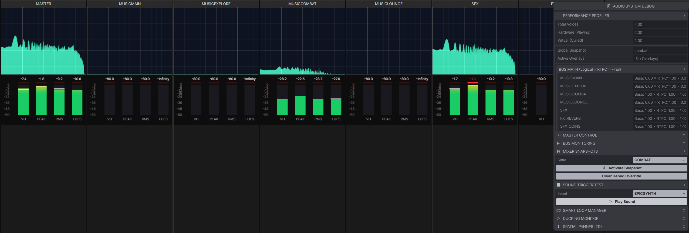

# Snapshot-Driven Virtual Mixing Console (SceneGrid Console)

[](https://www.npmjs.com/package/scenegrid-console)
[](https://www.typescriptlang.org/)
[](https://vitest.dev/)
[](https://github.com/rapt0p7/scenegrid-console)
[](https://prettier.io/)
[](./LICENSE.md)
[](https://developer.mozilla.org/en-US/docs/Web/API/Web_Audio_API)

> **Project Status:** Independent research project started ~mid 2025.

The **SceneGrid Console** is a high-performance, virtual digital mixing console built on the Web Audio API. It features a fixed signal path architecture, sample-accurate automation, and support for complex, multi-layered mix states.

Conceptually, the system bridges the gap between:
* **DAW-style Mixers:** Professional-grade channel strips and routing.
* **Game Audio Engines:** Data-driven triggering and dynamic resource management.
* **Hardware Consoles:** Total recall capabilities via snapshots and scenes.

---

## 📚 Documentation & Architecture Diagrams
For a deep dive into the system's topology, including **C4 Container Diagrams** and the complete **Audio Signal Flow**, please refer to the detailed documentation:
* 🇬🇧 [Audio System Architecture - English](./docs/AudioSystem%20-%20Description.md)
* 🇷🇺 [Архитектура Аудио Системы - Русский](./docs/AudioSystem%20-%20Description.RU.md)

---

## 1. System Architecture & Signal Flow

The system enforces a strict hierarchical flow to ensure phase coherence, predictable routing, and DSP stability. No bypass routes are permitted.

### The Core Hierarchy
**Source (Voice) → Individual Channel (NodeChain) → Group Bus → Master Output**

* **Isolated Sources (Voices):** Each sound is fully isolated with its own local processing chain, preventing phase conflicts and ensuring that one voice's processing never bleeds into another.
* **Voice Culling:** The `PlaybackScheduler` and `VoiceCullingSystem` monitor active voice limits. To maintain FPS stability and prevent Audio Thread overload, the system transparently terminates low-priority or silent sounds.
* **Audio Buses:** Function as group channels with a fixed channel strip structure. Routing is immutable once a sound starts, preventing "runaway" feedback or uncontrolled summing.

### Master Section
The single exit point to the hardware destination. It includes:
* A master fader and **Brickwall Limiter** (`TinyLimiterNode`).
* **`silentTail`:** A zero-volume output branch that keeps DSP processors (sidechain detectors, analyzers) active without leaking their internal "trigger" audio into the final mix.

---

## 2. The Channel Strip

Each Audio Bus implements a standardized processing chain:

| Stage | Node / Parameter | Function |
| :--- | :--- | :--- |
| **1. Input Gain** | `inputGain` | Main automation point for snapshots, RTPCs, and sidechaining. |
| **2. Pre-Filter** | `preFilterGain` | Insertion point for **Lookahead Delay**, providing clean compression attacks. |
| **3. Insert Filter** | `FiltersPlugin` | Supports "Safe Swap" logic—smoothly reconfiguring filters without digital clicks. |
| **4. Post-Gain** | `postFilterGain` | Final stabilization stage and the **Tap Point** for Sends and Visualizers. |

---

## 3. Advanced Audio Features

### Lookahead Sidechain Ducking
Powered by `AudioWorklet`, the system supports predictive ducking with cascade protection.
1.  **Trigger Summing:** Multiple sources sum into a `mergeGain` node.
2.  **Hard Clipping Protection:** A `WaveShaperNode` safely clamps overlapping triggers to a [-1.0, 1.0] range, preventing math breakdown during heavy cascade events (e.g., multiple simultaneous explosions).
3.  **Envelope Analysis:** The `ducker-processor` calculates the RMS envelope from the normalized signal.
4.  **Predictive Attenuation:** A `DelayNode` is inserted into the target bus, allowing the gain to drop *before* the trigger peak for a pop-free, professional attack.

### SmartLoopManager (Interactive Music)
A professional-grade sequencing engine for horizontal music transitions:
* **Audio Sprites:** Seamlessly loops regions within a single file.
* **Quantized Transitions:** Syncs changes to a musical grid (BPM/Bar).
* **Clip-Level Crossfades:** Transitions happen within the `NodeChain`, keeping the main Bus automation free for global mix changes.

### Auxiliary Sends
Parallel routing allows for shared effects (e.g., a single Reverb bus for all SFX), significantly reducing CPU overhead. Tapping occurs **Post-Filter** to ensure processed audio is sent to the FX chain.

---

## 4. Total Recall & RTPC

### VCA-Style Snapshots & Layers
The system supports **Total Recall** using a VCA (Voltage-Controlled Amplifier) multiplication model.
* **Data-Driven Mixer:** The base configuration (`IBuses`) acts as the master fader. Snapshots act as modulators (`Final Gain = Base * Snapshot * RTPC`).
* **Multi-Layer Logic:** Mix states can be safely layered (e.g., a "Combat Layer" atop an "Explore Layer"). The `MixerStateManager` calculates the final values, automatically handling "cold starts" with zero-latency protection to prevent audio bursts.

### RTPC (Real-Time Parameter Control)
A virtual patchbay connecting game data (speed, health, distance) to audio parameters, featuring an independent ~33Hz Control Rate loop to protect the main thread.
* **Global Manifest & Slew Rates:** Designers define FPS-independent inertia (`attackMs` / `releaseMs`) in a global registry, ensuring parameters transition smoothly over time (e.g., health drops instantly but regenerates slowly).
* **Curve Presets:** Built-in mathematical evaluators for `linear`, `exponential`, `logarithmic`, and `s-curve` mappings, alongside support for custom Piecewise Linear coordinate arrays.
* **Macro Modulation:** Patch RTPCs to VCA levels, Filter Cutoffs, Panning, or Send Levels with automatic DSP de-zippering (smoothing).

---

## 🚀 Roadmap: Towards a Complete Audio Middleware

*Note: Core stability, Parameter Resolution Pipeline, and basic polyphony rules are part of the v1.0 (Soft Launch) milestone. The following roadmap outlines the evolution of the engine in post-launch updates.*

### 🔴 Phase 1: Advanced Mechanics & DX (v1.1)
* **Event-level State Machine:** Moving from basic "play(sound)" to "trigger(event)". Defining autonomous behaviors like `onPlay`, `onStop` (tails), and conditional logic.
* **Modular Insert API:** Expanding the `FiltersPlugin` into a generalized `InsertPlugin` interface. This will allow programmers to inject custom DSP graphs (e.g., procedural synths or oscillators) into a voice's `NodeChain` without breaking routing invariants.
* **Voice Culling Hysteresis:** Adding a time buffer to the virtualization logic to prevent "voice flutter" (rapid fade-in/fade-out) when active voices hover around the hardware polyphony limit.
* **Vite V8 Migration:** Upgrading the build pipeline to the **Rolldown-powered** engine for faster AudioWorklet compilation and improved Developer Experience.

### 🟡 Phase 2: Adaptive Music & Living Sound (v1.2)
* **Internal Modulators:** Native LFOs and Envelopes for continuous parameter modulation (Pitch/Gain/Filter) to eliminate "sterile" digital playback without relying on external Game Engine Tickers.
* **Unified Music Manager (The Conductor):** A high-level facade to coordinate **Horizontal** transitions (via `SmartLoopManager`) and **Vertical** intensity changes (via `MixerStateManager`).
    * *Example:* `music.setIntensity(0.8)` smoothly ramps RTPC parameters and mixer layers, while `music.transitionTo('Combat')` triggers a quantized region change.
* **Semantic Music States:** Moving away from manual snapshot pushing to state-based logic (e.g., *Exploration* → *Combat*) where the engine resolves both the loop region and the mix layer automatically.

### 🟢 Phase 3: Spatial Context & Environments (v2.0)
* **Dattorro Reverb Integration:** Implementing high-quality algorithmic plate reverb natively as an FX Bus plugin.
* **Environment System:** Logic-based Reverb Zones and Acoustic States (e.g., "Underwater", "Caves") utilizing the existing Aux Sends and Snapshot architecture.

---

## 5. Repository Structure

Based on the internal dependency graph:

```text
src/
├── AudioEngine.ts        # Primary API Facade
├── BusSystem/            # Bus logic and Channel Strip management
├── Core/                 # DSP (Sidechain, Limiters, Filters)
├── Managers/             # State, Snapshots, and RTPC Management
├── webaudio-core/        # Low-level Web Audio wrappers & Automation
└── helpers/              # Math, Visualizers, and Worklet Processors
```

---

## 6. System Invariants

To ensure absolute mix predictability, the following are strictly prohibited:
1.  **Direct Source-to-Master connection** (must go through a Bus).
2.  **Manual Parameter Control** outside of the Automation/RTPC system.
3.  **Feedback Loops** within the Sends system.
4.  **Main Thread Protection:** High-frequency game ticks must pass through the `RTPCManager`'s microtask batching and Control Rate loop; direct synchronous spamming of Web Audio AudioParams is prevented by design.

---

## Quick Start: System Initialization

The system follows a **Data-Driven** initialization pattern. This separates audio assets and bus configurations from playback logic, ensuring the engine is fully aware of the signal graph before any sound is triggered.

### Basic Bootstrap Example

The following example demonstrates how to configure the engine, initialize the registry, and unlock the `AudioContext` following a required user gesture.

```typescript
import { AudioEngine } from 'scenegrid-console';

// Configuration manifests
import Buses from './audio-config/Buses';
import Snapshots from './audio-config/Snapshots';
import SoundMap from './audio-config/SoundMap';
import soundManifest from './soundManifest';
import RTPCManifest from './rtpcManifest';

async function bootstrap() {
    // 1. Instantiate the Engine with a centralized configuration
    const audio = new AudioEngine({
        manifest: soundManifest,   // Registry of all audio assets
        buses: Buses,              // Fixed bus architecture
        snapshots: Snapshots,      // Preset mixer states
        soundMap: SoundMap,        // Logical mapping of sounds to buses
        rtpcManifest: RTPCManifest,// Global Slew Rates and default values for game parameters
        globalVoiceLimit: 32       // Polyphony limit for optimization
    });

    // 2. Initialize the Audio Registry and Worklet processors
    await audio.init();

    // 3. Browser Security: Unlock AudioContext via User Interaction
    globalThis.addEventListener('pointerup', async () => {
        // Required to resume the AudioContext on modern browsers
        await audio.unlock();

        // 4. Set Initial Mix State (Snapshots)
        // Push the base state onto the mixer stack
        await audio.mixer.setState('idle');

        // 5. Start Playback
        audio.play('backgroundMain', { isLoop: true });
        audio.play('backgroundMain2', { isLoop: true });
        audio.play('backgroundMain3', { isLoop: true });
    }, { once: true });
}

bootstrap().catch(console.error);
```

### Initialization Workflow

* **Centralized Registry (`SoundRegistry`):** All assets and routing must be defined during construction to maintain strict hierarchical flow.
* **Voice Culling:** Defining `globalVoiceLimit` allows the `PlaybackScheduler` to manage the Audio Thread load and maintain FPS stability from the start.
* **The Unlock Pattern:** The `.unlock()` method must be called within a user-initiated event (e.g., `pointerup`) to comply with browser autoplay policies.
* **Mixer Layers:** Use `audio.mixer.push()` to apply the initial gain and filter settings defined in your Snapshots.

---

## 🎛️ Audio Debugger & Visualizer
The engine includes a built-in UI for real-time monitoring of Bus levels, RMS envelopes, and Spectrum Analysis, ensuring your mix stays out of the red.



---

## License

Copyright © 2025-2026 Igor Zabrodin.
Licensed under the **PolyForm Noncommercial License 1.0.0**. See the `LICENSE.md` file for details.

---
