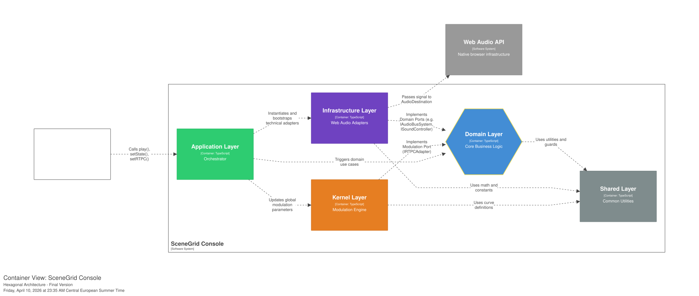
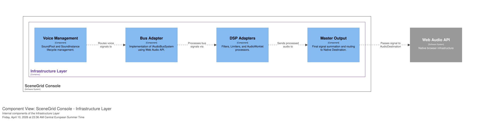

## General System Positioning & Observability

The system is an **observability-first simulation, debugging, and execution platform** for real-time Web Audio. While conceptually featuring a virtual digital mixing console, its primary goal is to make complex audio states predictable, traceable, and GC-safe.

Conceptually, it is a hybrid of:

- A System-Level Debugger (Causal tracing and mix simulation)
- A DAW mixer (Professional-grade channel strips and routing)
- A Game Audio Engine (Data-driven triggering and Zero-Allocation resource management)

---

**Facade and Configuration Management (Engine API)**
Interaction between the client application and the audio engine occurs through a single facade (`AudioEngine`). The system operates on a strict **Data-Driven** principle: all routing, macro, and bus settings are initialized via a centralized manifest registry. Decoupling playback logic from hardcoded values is what allows the DevTools to visualize and trace the audio graph before any sound is triggered.

The engine natively supports **Hot Module Replacement (HMR)** via `_hotReloadConfig`, allowing developers to dynamically update buses, RTPC curves, and sound maps without destroying the active `AudioContext` or interrupting gameplay.

**Declaration Merging (Type-Safe Facade):** To eliminate "Stringly-typed code" without violating the Dependency Rule (the Engine must not import Game configurations), the `IAudioEngine` facade utilizes TypeScript Declaration Merging. The engine exposes a generic `SceneGridRegistry`. The client application extends this registry with its own static asset literals (`AutocompleteSound`, `AutocompleteEvent`). As a result, the game developer gets AAA-level IDE autocomplete for all specific sound names, while the engine's core (Domain) remains 100% agnostic and continues to operate on strict Branded Types.

---

## 0. Architectural Philosophy: Ports & Adapters

To ensure long-term maintainability, testability, and **offline simulation capabilities**, the system follows a **Hexagonal (Ports and Adapters)** pattern.

- **Logic vs. Implementation:** The logic of how a signal _should_ flow (Domain) is separated from the creation of `GainNode` or `AudioWorklet` (Infrastructure).
- **Simulation & Tracing:** Because the Domain is pure, the DevTools can mathematically simulate mixer states, evaluate RTPC curves, and predict voice culling decisions without requiring an active browser `AudioContext`.
- **Modularity:** You can theoretically replace the Web Audio implementation with a different backend without modifying the `Domain` layer.

---

### 1. Signal Flow & Data-Oriented Architecture

**Core Principle**
Signals follow a strict hierarchy: **Source → Individual Channel → Group Bus → Master**. No bypass routes are permitted. This strictness guarantees that the audio graph remains visually traceable in the debugger without "ghost" signals.

**Sources (Voices) & Data-Oriented Design**
Each sound is fully isolated with its own local processing chain.
To eliminate Garbage Collection (GC) spikes during heavy gameplay, voices and tasks are managed using **Data-Oriented Design (DOD)** principles. The system utilizes pre-allocated flat arrays and a "swap-and-pop" algorithm for O(1) registration and cleanup, bypassing traditional object allocations entirely.

**Voice Culling (Deterministic Polyphony & Hysteresis)**
A Voice Culling mechanism is implemented at the core level. The domain-driven `VoiceCullingArbiter` continuously monitors active voice limits and applies a **hysteresis window** to prevent rapid virtualization/devirtualization flickering during minor volume fluctuations. Sounds maintain distinct **logical states** (`playing` vs. `paused`), ensuring that a paused sound remains safely virtualized even if its underlying volume conditions change.

**Audio Buses**
Buses function like **console group channels**.

- Fixed channel strip structure.
- Routing is defined only once at the sound's start.
- If no route is defined, the signal is blocked.

**Master Section**
The sole exit point to the audio device. It contains:

- Master fader & Brickwall limiter
- A dedicated **`silentTail`** (zero volume) that ensures continuous operation of DSP processors without leaking their audio into the mix.

---

### 2. Bus Channel Strip Structure

Each bus features a standard processing path with explicit tap nodes to guarantee accurate observability regardless of dynamic FX swapping:

1. **Input Gain (`inputGain`)**: The main fader; the point for automation, RTPC, and primary level management.
2. **Pre-Filter / Lookahead (`duckerTapNode`)**: The insertion point for sidechain analysis. Tapping the signal _before_ the filter ensures clean compression tracking uncolored by EQ changes.
3. **Insert Filter (`filter`)**: A universal filter (equivalent to an insert EQ). Implemented via an isolated **plugin architecture** supporting asynchronous "Safe Swaps" to prevent audio artifacts during concurrent filter changes.
4. **Post-Gain (`postFilterGain` & `analyzerTapNode`)**: The final stabilization stage. Serves as the tap point for auxiliary Sends and DevTools visualizers.

---

### 3. Automated Sidechain & Dynamic Processing

Sidechain topology is fully data-driven. `createSidechain` is intentionally omitted from the public API; instead, sidechains are automatically instantiated based on the `sidechain.enabled` flag within the bus manifest.

**Operational Features**

- **Per-Source Intensity:** Different sounds can trigger the compression envelope at different strengths via a customizable intensity gain mapping.
- **Hard Clipping Protection**: A `WaveShaperNode` safely clamps overlapping triggers to a strict [-1.0, 1.0] range before analysis to prevent math breakdowns during heavy cascade events.
- **Predictive Attenuation (Lookahead)**: A `DelayNode` is dynamically inserted into the bus path. Suppression occurs **before the peak**, resulting in a clean attack without digital pops.

---

### 4. Snapshots and Automation (Total Recall)

The system supports a **complete recall of the mixer state** using a VCA (Voltage-Controlled Amplifier) multiplication model.

**VCA-Style Snapshots**
Instead of simple value overrides, the mixer uses mathematically scaled snapshots:
- The base configuration (`IBuses`) acts as the master fader.
- Snapshots act as modulators.
- Final Gain = Base Gain × Snapshot Gain × RTPC Gain

This ensures predictable scaling when multiple mix states overlap, allowing the DevTools to accurately explain the final volume of any bus.

**State Transitioning**
Transitions are seamless: all changes are ramped with sample-accurate precision to exclude clicks or level jumps. The system implements **Zero-Latency Cold Start Protection**, forcing instant application (`durationMs: 0`) of the initial snapshot to prevent audio bursts upon engine initialization.

---

### 5. Multi-Layer Mix Logic

The mixer supports **state layers**, analogous to theater console scenes or DAW automation layers.

**The Purpose of Layers**
They allow independent management of: music, SFX, UI sounds, and various game contexts.

**Mix Finalization**
1. Active layers are safely superimposed using the VCA multiplication model.
2. The `MixerTransitionEngine` calculates the final transition ramps and parameters.
3. Values are committed to the automation engine for sample-accurate interpolation.

---

### 6. Memory Management: Bank System

Relying solely on loading individual audio buffers leads to memory bloat. The engine enforces memory hygiene through a **Bank Loading System** (`BankManagerAdapter`). Developers group audio assets into logical Banks, allowing for bulk asynchronous loading (with fallback dummy buffers for decode errors) and safe, deterministic unloading when a context or scene is destroyed.

---

### 7. Deterministic Orchestration (Horizontal vs. Vertical)

The system natively supports professional interactive music patterns, strictly separating horizontal sequencing from vertical intensity to ensure the mix state remains predictable for the DevTools.

**Autonomous Music Conductor (FSM):** At the highest level, interactive music is driven by the `MusicConductor`—a Zero-Allocation finite state machine. It evaluates gameplay states (via RTPCs) using pure functions and dispatches immutable `MusicCommand` DTOs (Target Time, Crossfade, Target Region). It maintains an absolute "I/O Sandwich", decoupling the decision-making phase from the actual `Sequencer` execution, ensuring 0 GC-spikes during complex musical transitions.

**Horizontal Sequencing (The `Sequencer` & Smart Loops)**
Instead of triggering multiple separate files chaotically, the `Sequencer` works with audio sprites (regions) within a single media file to manage musical time.

Key capabilities:

* **Smart Looping (Overlap Preservation):** Supports gapless looping of specific musical regions with built-in `preEntryMs` (pickup notes/upbeats) and `tailMs` (reverb/decay tails). This architecture ensures natural musical phrasing and prevents unnatural cuts, all while maintaining the underlying rhythmic grid without allocating overlapping `AudioNodes` manually.
* **Condition-Driven Transitions:** A dedicated `SmartLoopTransitionPolicy` evaluates predefined "magnet" conditions to dynamically resolve the optimal transition path and timing between looping regions, preventing chaotic jumps.
* **Phase-Aware Jumps (`offsetMode`):** When moving between regions, the engine supports multiple alignment behaviors to preserve the musical meter and phase:
* **None (Default):** Starts the target region precisely from its defined beginning.
* **Relative:** Preserves the current playback offset (e.g., jumping seamlessly from beat 3 of Region A directly to beat 3 of Region B).
* **Inverted:** Mathematically mirrors the offset relative to the region's duration, useful for specific rhythmic or reversing patterns.
* **Quantized Stinger Injection:** A dedicated `playStinger` pipeline allows short, non-looping audio events (e.g., a cymbal crash or musical flourish) to be injected with temporal precision, quantized to the next beat or bar of an active reference track.
* **Local Crossfades:** Blending regions occurs strictly at the individual channel level (`NodeChain`), preserving global bus automation and preventing routing graph pollution.

**Vertical Layering (Snapshots & RTPC)**
Dynamic intensity is **not** handled by the Sequencer. Vertical music is achieved entirely through the `MixerTransitionEngine` and `RTPCManager`:

* Stems are routed to dedicated buses.
* Game logic pushes Snapshots or drives RTPC curves to fade stem buses in and out dynamically, keeping vertical mix states completely decoupled from timeline logic.

---

### 8. Event Orchestration & Recursive Resolution

In a true Enterprise-grade audio engine, the game client should never hardcode complex audio behaviors. SceneGrid strictly decouples gameplay triggers from audio execution through a two-tiered resolution pipeline: **Event Orchestration** (Macros) and **Container Resolution** (Assets).

#### Tier 1: The Event Orchestrator (Action Macros)

Instead of the game client manually starting sounds and tweaking parameters, it simply dispatches semantic triggers via `engine.postEvent('Player_Jump')`.
The `AudioEventOrchestrator` intercepts this and executes a predefined list of actions from the `EventMap`. This advanced macro-system acts as the central nervous system, capable of simultaneously executing complex logic:

* **Playback & State Control:** Play/stop sounds, trigger nested events (safeguarded against infinite recursion), or manipulate global variables (`set_rtpc`).
* **System Integration:** Directly command the Mixer (`set_mixer_state`, `add_mixer_modifier`) or the Sequencer (`start_loop`, `music_transition`, `play_stinger`).
* **Conditional & Probabilistic Execution:** Actions can be delayed (`delayMs`), given a chance of execution (`probability`), or gated behind logical conditions based on real-time RTPC values (e.g., only play a heavy breathing sound *if* the `Stamina` parameter is `< 20`).

#### Tier 2: Container Resolution & Routing

When a `play` command is issued, it hits the `AudioRouter`. The router evaluates the target entity in the `SoundMap` before allocating Web Audio nodes. The target can be a simple AudioBuffer or a complex **Logical Container**:

* **Switch Containers:** Handled by the `SwitchPlaybackPolicy`, the router dynamically resolves the target sound based on current RTPC game states (e.g., swapping footstep sounds based on a `Surface_Type` parameter).
* **Scatterer Containers:** Managed by the `ScattererOrchestrator`, these procedurally spawn overlapping audio instances over time (e.g., random ambient debris or flocking birds) and can be strictly quantized to a musical grid.
* **Random & Sequence Containers:** Evaluates playback rules to defeat the "machine-gun effect" by selecting variations without manual coding.

**Deterministic Variability**
To maximize asset reusability and prevent auditory fatigue, the engine applies real-time variability at the moment of instantiation.

* **Micro-Randomization:** Designers can define deterministic boundaries in the manifest (e.g., `pitchVar: 0.08`).
* **Seeded Reproducibility:** All randomization is powered by a central `SeededPRNG` rather than the native `Math.random()`. This guarantees that variations are entirely deterministic, allowing for mathematically reproducible audio generation during testing and debugging.
* **Architecture Alignment:** This variability is calculated purely mathematically in the Domain layer and passed as initialization properties to the `SoundInstance`, preventing unnecessary DSP overhead and ensuring modifiers are fully visible in the DevTools Debugger.

**Strict Determinism**
All randomization (spatial spread, pitch variation, container selection) is powered by a central **`SeededPRNG`**. This guarantees that variations are mathematically deterministic and identically reproducible for automated testing.

---

### 9. Static Graph Analysis & AOT Validation (`ConsistencyChecker`)

In a purely Data-Driven audio engine, misconfigurations (such as routing feedback loops or missing audio targets) can lead to silent runtime failures. SceneGrid eliminates this risk by employing an **Ahead-of-Time (AOT) Consistency Checker** — a static analyzer for your audio manifests that runs during system initialization.

Before a single Web Audio node is allocated, the engine validates the entire configuration graph to guarantee structural integrity and prevent logic conflicts. If critical errors are found, the engine explicitly aborts initialization, ensuring predictable fail-fast behavior.

**Key Validation Pillars:**

* **Topology & Routing Protection:**
    * **Feedback Loop Prevention:** Executes a Depth-First Search (DFS) algorithm to ensure buses do not send audio back into themselves or create infinite routing cycles (e.g., `A -> B -> C -> A`).
    * **Target Legality:** Guarantees that every sound, send, and sidechain ducking target points to an explicitly defined and initialized Bus.

* **Logical Integrity & Conflict Resolution:**
    * **Ghost Ducking Analysis:** Detects state conflicts, warning developers if a sound is configured to duck a target bus, but its own parent bus is muted in the current Snapshot (resulting in "ghost" compression).
    * **Multiplicative Vetoes:** Identifies collisions between dynamic RTPC controls and hardcoded Snapshot overrides to prevent erratic volume scaling.
    * **Event & Magnet Validation:** Ensures that all `SmartLoop` transition conditions and `Switch Container` states point to registered variables within the `RTPC Manifest`.

* **Asset Hygiene (Memory Safety):**
    * **Orphan Detection:** Cross-references the loaded asset manifest with the `SoundMap` (including nested `Switch` layers and `Events`). It proactively flags unused audio files ("orphans") loaded into memory, helping technical audio designers optimize RAM usage before shipping.

By treating audio configurations as compilable code, the `ConsistencyChecker` acts as the first line of defense for system stability, preserving frame rates and preventing unpredictable DSP behavior.

---

### 10. Sends and Parallel Routing (Auxiliary Sends)

In addition to direct hierarchical routing, the system provides a parallel routing mechanism via Sends, acting as the DAW equivalent of **Aux Sends**.

**1. Architecture and Signal Flow**
Within the strict isolation of the graph, the Sends system maintains the core invariant: no bypass routes to the physical output. A Send is a controlled branch of the signal from one bus to another (FX / Return Bus).
- **Tap Point**: Send control is managed via a dedicated `GainNode`. Signal tapping occurs **Post-Filter** (from the `postFilterGain` node of the source bus), meaning the signal is sent to the FX bus with local EQ applied.
- **Routing**: The branched signal is routed strictly to the input node of the target bus, which processes it and outputs it to the `MasterOutput` normally.

**2. Use Cases**
- **Shared FX (Reverb/Delay)**: Significantly reduces CPU load by avoiding duplicate heavy effects on every voice.
- **Parallel Compression (New York Compression)**: Summing dry and processed signals in the `MasterOutput`.

---

### 11. Centralized Scheduling & RTPC (Pull Model)

The RTPC mechanism acts as a **virtual patchbay** for control signals (Control Voltage / Macros). It links "dry" game data (speed, distance, health) to the physical parameters of the audio path in real-time, utilizing advanced performance throttling.

**1. The Macro Control Hub & Centralized Ticker**
Instead of the game engine directly manipulating Web Audio API faders at frame rate, it sends values to the `RTPCManager`. The manager is driven by a centralized `EngineTicker` and utilizes microtask batching (`flush`) to protect the main thread and Audio Context from event spam.

**2. Global Manifest & Slew Rates (Inertia)**
Designers define FPS-independent inertia (`attackMs` / `releaseMs`) and default values in a global `RTPCManifest`. This ensures parameters transition smoothly over time without requiring manual smoothing on every sound.

**3. Mathematical Presets & Custom Curves**
The system uses an advanced `MathCurveDefinition` evaluator for mapping values:
- **Presets**: Built-in support for `linear`, `exponential`, `logarithmic`, and `s-curve` mappings.
- **Piecewise Linear Curves**: Support for custom coordinate arrays (x, y) for complex shape definitions.

---

### 12. Multi-Tiered Observability & Telemetry

SceneGrid features a full-fledged observability pipeline designed to feed the Inspector without causing GC pauses.

- **AudioGraph & Inspector:** The engine emits a structural manifest upon initialization, allowing external React-based dev tools (using ELK.js) to render a live, topological view of the active mix.
- **Zero-Allocation Telemetry:** Telemetry objects (Snapshots, Lifecycle events, Cause Chains) are heavily pooled via `CyclePool` to prioritize reuse over allocation.
- **Command Pipeline (Inspector -> Engine):** Through the `IInspectorDebugPort`, developers can inject algebraic commands (e.g., `SET_SWITCH`, `PLAY_LOOP`, override RTPC values) directly into the running game instance. This allows Audio Engineers to simulate edge-case scenarios and test mixer states in real-time without modifying the game's actual code.
- **Broadcast Transport:** Telemetry is dispatched via `BroadcastTelemetryTransport`, allowing developers to run the Inspector in a separate browser tab/window without dragging down the game's performance.
- **Deep Tracing:** Emits `LIFECYCLE` events (start, pause, virtualize) and `CAUSE_CHAIN` events to trace exactly why a specific action was blocked or culled.
- **DSP Worklets:** Hardware-level RMS meters and spectrum analyzers run entirely on the `silentTail` AudioWorklets, ensuring zero main-thread overhead.

---

### 13. Temporal Coordinate Systems (DDD Time Domains)
To prevent catastrophic scheduling desynchronization (e.g., passing musical beats into a Web Audio API method expecting absolute seconds), SceneGrid employs strict mathematical separation of time domains using TypeScript Branded Types (following Domain-Driven Design principles).

*   **Physical Time (Data Plane):**
    *   `ContextTime`: Absolute hardware timestamp (`audioContext.currentTime`). The only type allowed for exact scheduling (`when` in `ISoundController`).
    *   `Seconds` & `Milliseconds`: Relative durations and offsets (e.g., `seek`, `crossfadeDuration`).
    *   `Samples`: Discrete values for exact buffer manipulation.
*   **Musical Time (Control Plane):**
    *   `BPM`, `Beats`, and `Pulses` (PPQN). Purely logical coordinates evaluated by the `AudioGrid`.

The compiler strictly forbids mixing these domains. Conversion between Musical Time and Physical Time occurs exclusively through pure math functions within the `AudioGrid` and `Sequencer`, ensuring sample-accurate, drift-free synchronization.

---

### 14. Stability Guarantees (System Invariants)

To maintain a single source of truth for the debugger, the following are **strictly prohibited**:

- **Direct Source Connection**: Connecting any audio source directly to the Master node. All signals must follow the strict hierarchy: Source → Bus → Master.
- **Bypassing Automation**: Any direct manipulation of `AudioParam` values. All changes must be scheduled via the `AutomationEngine`.
- **Manual Parameter Management**: Modifying bus or instance parameters from outside the dedicated managers.
- **Domain Isolation**: Domain components importing anything from the `Infrastructure` or `Application` directories. Communication with external systems must occur exclusively through **Ports** (interfaces).
- **Synchronous Parameter Spam**: Direct, unthrottled manipulation of `AudioParams`. High-frequency game ticks must pass through the `RTPCManager` batching system.
- **Domain Mutation (Zero Side-Effects)**: Implicit mutation of engine configurations, buses, or mixer snapshots. These must be treated as **DeepReadonly** structures. Any change in logical state must be computed via pure functions.

**Performance Invariant (The Mutation Exemption):**
The principle of immutability **does not apply** to the dynamic runtime state (**Data Plane**) within the `Infrastructure` and `Orchestration` layers. To comply with **Data-Oriented Design** and prevent Garbage Collection (GC) spikes, the infrastructure is mandated to perform **In-Place mutations** of pre-allocated object pools and stable data structures.

---

### 15. Architectural Gotcha: The Multiplicative Veto

Due to the transition to a multiplicative parameter resolution model (`Final Gain = Base Gain × RTPC Modifier`), the engine enforces a strict separation of orchestrator responsibilities. This strictness is what allows the DevTools to mathematically trace why a sound is muted.

Attempting to control the volume of the same bus simultaneously via global Snapshots and game metrics (RTPC) leads to a **mathematical veto**:
* If a Snapshot sets `gain: 0` (muting the bus), no RTPC modifier can bring it back to life (0 × 1.0 = 0).
* Conversely, if an RTPC curve hits `0`, activating a Snapshot with `gain: 1` will not enable the sound (1.0 × 0 = 0).

**The Golden Orchestration Rule:**
Each bus must have only one primary "driver" for its gain parameter.
1.  **RTPC-Driven Buses (Dynamic Music / Engine Sounds):** If a bus relies on RTPC for crossfades, its base gain in all Snapshots **must always remain 1.0** (or be omitted). Snapshots must never attempt to mute these buses.
2.  **Snapshot-Driven Buses (UI / Menu States):** If a bus volume is strictly controlled by game states, it should not have RTPC bindings that manipulate its gain based on gameplay metrics.
