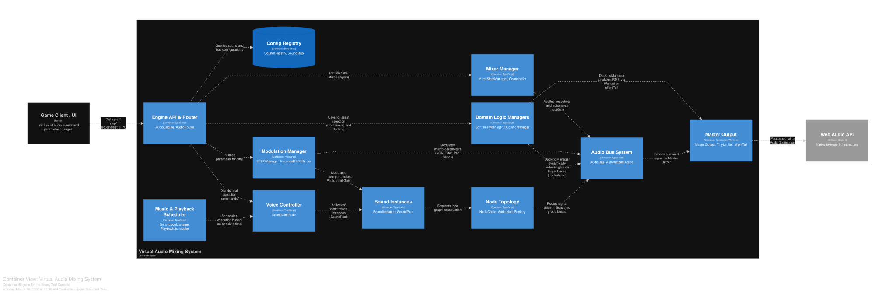

## General System Positioning

The system is a **virtual digital mixing console** featuring a fixed signal path architecture, precision automation, and support for multi-layered mix states.

Conceptually, it is a hybrid of:
* A DAW mixer
* A game audio engine
* A console with recall scenes
---

**Facade and Configuration Management (Engine API)**
Interaction between the client application and the audio engine occurs through a single facade (`AudioEngine` / `AudioRouter`). The system operates on a **Data-Driven** principle: all routing, macro, and bus settings are initialized via a centralized manifest registry (**`SoundRegistry`**), decoupling playback logic from hardcoded values.

---
### 1. Signal Flow Architecture

**Core Principle**
Signals follow a strict hierarchy:
**Source → Individual Channel → Group Bus → Master** No bypass routes are permitted.

**Sources (Voices)**
Each sound:
* Is fully isolated
* Has its own local processing chain
* Does not affect other voices

This guarantees an absence of phase conflicts, stable dynamic processing, and predictable routing.

**Voice Culling (Polyphony Optimization)**
A Voice Culling mechanism is implemented at the core level (`PlaybackScheduler`). The system automatically monitors active voice limits and prevents Audio Thread overload by transparently terminating the lowest-priority or quietest sounds, thus maintaining FPS stability.

**Audio Buses**
Buses function like **console group channels**.
Key properties:
* Fixed channel strip structure
* Routing is defined only once at the sound's start
* If no route is defined, the signal is blocked

This eliminates accidental connections, double-summing, and uncontrolled output to the master.

**Master Section**
The sole exit point to the audio device. It contains:
* Master fader
* Brickwall limiter
* A dedicated **`silentTail`** (zero volume) that ensures continuous operation of DSP processors (sidechain detectors and analyzers) without leaking their audio into the mix.

---

### 2. Bus Channel Strip Structure

Each bus features a standard processing path:

1.  **Input Gain (`inputGain`)**: The main fader; the point for automation (snapshots, RTPC), sidechain control, and primary level management.
2.  **Pre-Filter / Lookahead (`preFilterGain`)**: An insertion point for micro-delay used in predictive sidechaining. Ensures clean compression attack without digital clicks.
3.  **Insert Filter (`filter`)**: A universal filter (equivalent to an insert EQ). Implemented via an isolated **plugin architecture (`FiltersPlugin`)** supporting "Safe Swaps" without artifacts and smooth graph reconfiguration.
4.  **Post-Gain (`postFilterGain`)**: The final stabilization stage; serves as the **Tap Point** for the Sends system and metric collection for visualizers.

---

### 3. Sidechain and Dynamic Processing

The system supports **lookahead bus ducking** powered by `AudioWorklet`.

**Operational Features**
* Analysis is performed by a specialized **`ducker-processor`**, which calculates the envelope of the summed trigger signal.
* When sidechaining is active, a **`DelayNode`** (Lookahead) is dynamically inserted into the bus path between `inputGainNode` and `preFilterGain`.

**How Suppression Works**
1.  Trigger signals are summed in the **`mergeGain`** node.
2.  An envelope is calculated to modulate the `gain` of the **`duckingGain`** node.
3.  Due to the lookahead delay, suppression occurs **before the peak**, resulting in a clean attack without digital pops.
4.  The target bus gain is adjusted accordingly.

---

### 4. Snapshots and Automation (Total Recall)

The system supports a **complete recall of the mixer state**.

**Snapshots**
A snapshot is a comprehensive state capture:
* Gain levels of all buses
* Insert filter settings
* Dynamics parameters (sidechain statuses)
* Send levels to parallel buses
* Macro assignments (RTPC bindings)

**State Transitioning**
Transitions are seamless: all changes are ramped with sample-accurate precision to exclude clicks or level jumps, while accounting for the current sidechain state.

**Safe Filter Swapping**
When changing filter types, the system performs a brief fade-out, rebuilds the graph, and then fades in, preventing digital artifacts.

---

### 5. Multi-Layer Mix Logic

The mixer supports **state layers**, analogous to theater console scenes or DAW automation layers.

**The Purpose of Layers**
They allow independent management of: music, SFX, UI sounds, and various game contexts.

**Mix Finalization**
1.  Active layers are superimposed.
2.  The system calculates final parameters.
3.  Values are committed to the automation engine.

---

### 6. Interactive Music and Sequencing (SmartLoopManager)

The system includes a built-in engine for interactive music management, operating on professional audio sequencer principles. It handles **horizontal sequencing** of music segments and seamless transitions.

**Horizontal Sequencing**
Instead of triggering multiple separate files, the system works with audio sprites (regions) within a single media file.
Key capabilities:
* Artifact-free, gapless looping of specific regions.
* Independent state tracking for different musical layers.
* Utilization of absolute context time (`AudioContext.currentTime`) to prevent desynchronization.

**Seamless Transitions**
Supported modes:
* **Instant**: Immediate region swap.
* **Musical Grid (Quantized)**: Transitions synchronized to the musical grid (BPM, time signature).
* **Fills/Stingers**: Playback of intermediate transition regions.

**Clip-Level Automation (Local Crossfades)**
To blend regions smoothly, the system uses crossfading **strictly at the individual channel level (`NodeChain`)**. This preserves voice isolation and avoids conflicts with global bus snapshots.

---

### 7. Sends and Parallel Routing (Auxiliary Sends)

In addition to direct hierarchical routing, the system provides a parallel routing mechanism via Sends, acting as the DAW equivalent of **Aux Sends**.

**1. Architecture and Signal Flow**
Within the strict isolation of the graph, the Sends system maintains the core invariant: no bypass routes to the physical output. A Send is a controlled branch of the signal from one bus to another (FX / Return Bus).
* **Tap Point**: Send control is managed via a dedicated `GainNode`. Signal tapping occurs **Post-Filter** (from the `postFilterGain` node of the source bus), meaning the signal is sent to the FX bus with local EQ applied.
* **Routing**: The branched signal is routed strictly to the input node of the target bus, which processes it and outputs it to the `MasterOutput` normally.

**2. Use Cases**
* **Shared FX (Reverb/Delay)**: Significantly reduces CPU load by avoiding duplicate heavy effects on every voice.
* **Parallel Compression (New York Compression)**: Summing dry and processed signals in the `MasterOutput`.
* **Dynamic Spatial Morphing**: Dynamically changing send levels based on game state changes.

---

### 8. Real-Time Parameter Control (RTPCManager)

The RTPC mechanism acts as a **virtual patchbay** for control signals (Control Voltage / Macros). it links "dry" game data (speed, distance, health) to the physical parameters of the audio path in real-time without disrupting snapshots.

**1. The Macro Control Hub**
Instead of the game engine directly manipulating Web Audio API faders, it sends values to the manager. The manager acts as a reactive broker (using `mitt`), broadcasting changes only when there are real deltas.

**2. Custom Transfer Curves**
The system uses **Piecewise Linear Curves** instead of basic min/max scaling.
* **`RTPCPoint[]`**: Sound designers define curve shapes via coordinate arrays $(x, y)$, allowing for S-curves, exponents, etc.
* **DSP Mapping**: The `evaluateRTPCCurve` function finds the relevant segment and interpolates the physical value (e.g., `playbackRate`).

**3. Instance Control (Micro-Modulation)**
Independent parameter control for a specific sound instance without affecting the entire bus.
* **Target Parameters**: Pitch, local gain, pan, and filter frequency.
* **Sample-Accurate Smoothing**: Smooth gliding via internal automation methods.

**4. Bus-Level Control (VCA)**
RTPC can be patched to 4 key elements:
1.  **VCA Level (`gain`)**: Dynamic bus volume (e.g., ducking music during combat).
2.  **Filter Cutoff (`filterFrequency`)**: Insert filter frequency (e.g., LPF "concussion" effect).
3.  **Panning (`pan`)**: Group-wide stereo positioning.
4.  **Aux Send Level (`sendLevel`)**: Dynamic control of parallel FX levels.

---

### 9. Monitoring and Analysis

The system supports RMS meters, spectrum analyzers, and DSP detectors. These are implemented as independent **AudioWorklet Plugins** (e.g., `MeterProcessor`) operating via the `silentTail` path:
* They do not color the sound.
* They do not affect phase.
* They do not increase main mix latency.

---

### 10. Stability Guarantees (System Invariants)

The following are **strictly prohibited**:
* Direct source connection to the Master.
* Bypassing automation.
* Manual parameter management outside the system.

This ensures mix predictability, prevents automation conflicts, and maintains DSP stability.

---

**Summary**
The system is a **highly structured virtual digital console featuring lookahead sidechaining, sample-accurate automation, recall scenes, and multi-layered mix management**, optimized for stability, predictability, and the absence of digital artifacts.

---
