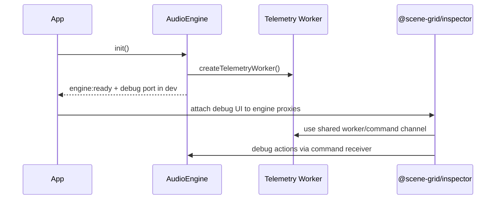

# Architecture Overview

This repository is a workspace monorepo centered on a browser audio runtime and a separate inspector package. The core architectural boundary is a hexagonal runtime: the engine owns orchestration and domain behavior, while infrastructure provides the Web Audio and telemetry adapters that the engine binds together at startup.

## System boundaries

- `@scene-grid/engine` is the runtime package. It exposes `AudioEngine` as the application façade and re-exports the runtime-facing contracts and infrastructure types.
- `@scene-grid/inspector` is the debug/observability package. It builds a browser UI around an engine instance and its bus/master-node proxies.
- `@scene-grid/shared` provides cross-cutting contracts and utilities used by both packages, including branded identifiers, math helpers, guard functions, a shared worker factory, and telemetry types.
- The workspace root coordinates package builds, tests, linting, formatting, and typechecking across the monorepo.

## Package dependency shape

`shared` sits at the bottom of the package graph. The engine depends on shared types and helpers; the inspector consumes engine-facing proxies plus shared worker utilities; and the root workspace script surface orchestrates all packages.

```mermaid
flowchart LR
    shared[@scene-grid/shared]
    engine[@scene-grid/engine]
    inspector[@scene-grid/inspector]
    root[workspace root]

    shared --> engine
    shared --> inspector
    engine --> inspector
    root --> engine
    root --> inspector
    root --> shared
```

## Hexagonal runtime split

The engine package is organized around an application layer that assembles domain services and infrastructure adapters:

- `packages/engine/src/Application/AudioEngine.ts` creates and wires the runtime graph.
- `packages/engine/src/Infrastructure/index.ts` exports the concrete adapters: audio context management, bus and node factories, scheduling, loaders, telemetry transports, limiter/sidechain plugins, and related helpers.
- `packages/engine/src/index.ts` is the public package surface; it re-exports `AudioEngine`, core enums and types, and infrastructure abstractions so consumers can assemble a runtime without reaching into internal files.

The runtime’s architectural invariant is that the application façade owns orchestration while infrastructure owns technical integration. `AudioEngine` constructs the infrastructure objects, feeds them with config, and coordinates their lifecycle; the lower-level adapters remain replaceable and are referenced through interfaces and port types.

## End-to-end runtime flow

```mermaid
flowchart TD
    A[App creates AudioEngine with authored config] --> B[AudioEngine freezes config and starts init()]
    B --> C[Validation and telemetry worker setup]
    C --> D[AudioContextManager, EngineTicker, automation, routing, pool, bank, mixer, sequencer]
    D --> E[EngineTicker registers runtime tasks]
    E --> F[engine:ready emitted after the graph is assembled]
    F --> G[App unlocks audio on a user gesture]
    G --> H[Play / stop / snapshot / RTPC / bank APIs route through engine facades]
```

### What `AudioEngine` actually owns

`AudioEngine` is more than a thin wrapper. During `init()` it:

- creates a telemetry worker and wraps it in a worker transport;
- runs configuration validation and can fail early in strict mode;
- creates the audio context manager, engine ticker, automation engine, bus system, sound pool, buffer loader, router, sequencer, mixer snapshot manager, bank manager, culling runner, and event orchestrators;
- registers ticker tasks for telemetry, snapshotting, RTPC updates, bus-system RTPC propagation, instance RTPC binding, sound scheduling, culling, mixer transitions, scatterer orchestration, audio events, and optional music conduction;
- emits lifecycle events such as `load:start`, `load:progress`, `load:complete`, `unload:complete`, `engine:ready`, and `engine:error`.

The public façade then exposes runtime capabilities in domain-oriented groups: events, RTPC parameter access, mixer snapshot control, music sequencing, spatial positioning, bank loading, and transport controls such as unlock/suspend/play/stop/pause/resume.

## Inspector/runtime relationship

The inspector is intentionally decoupled from production runtime code paths. The runtime only attaches inspector support in non-production mode, where it builds an inspector debug port and starts a command receiver that listens over the telemetry worker channel. That port lets the inspector trigger high-value runtime actions such as firing events, applying snapshots, overriding RTPC and switch state, stopping or pausing playback, and driving music transitions.



The inspector package itself renders bus and master-node analysis views. `AudioDebugger` requires a bus-system proxy and master node proxy, looks up the wrapper element, and then creates frequency and meter visualizations for the master bus plus each active bus tap. If the wrapper is missing, it logs a warning and exits without mutating the page.

## Shared package role

`@scene-grid/shared` is the common foundation rather than a dumping ground. It provides the identifier and telemetry types that let the runtime and inspector speak the same language, along with helpers used by the engine’s orchestration and lifecycle logic:

- branded and music/condition types for strongly typed IDs and domain values;
- `DeepReadonly`, `clamp`, `deepFreeze`, guards, and typed object helpers;
- math and RTPC helpers such as curve evaluation and seeded randomness;
- `createTelemetryWorker()`, which constructs the shared worker used by runtime telemetry and inspector command flow.

## Operational model and failure behavior

A few operational rules matter across the repository:

- The engine config is frozen at construction time, which prevents later mutation of the runtime’s source-of-truth settings.
- `banks.load()` / `banks.unload()` are no-ops until the engine has been initialized, and `getState()` reports `UNLOADED` before initialization.
- Initialization can continue with warnings in non-strict mode, but strict validation emits `engine:error` and exits early.
- If initialization throws, the engine emits `engine:error` with the failure message and rethrows.
- Missing inspector mount points are treated as a recoverable UI issue, not a runtime failure.

## Repository-level validation and build surface

The workspace root exposes the main operational commands for the monorepo: workspace-wide build, test, typecheck, lint, format, and mutation testing. That mirrors the architecture: packages stay focused, while integration quality is enforced at the root.

## Where to read next

- [Engine package overview](../engine/overview.md) for the runtime package map and subsystem details.
- [Inspector package overview](../inspector/overview.md) for the debug UI and visualization flow.
<!-- openwiki: broken internal link [../shared/overview.md] file "../shared/overview.md" does not exist. Fix the href or restore the target, then delete this comment. -->
- [Shared package contract](../shared/overview.md) for the reusable types and helpers.
<!-- openwiki: broken internal link [../workflows/runtime-bootstrap.md] file "../workflows/runtime-bootstrap.md" does not exist. Fix the href or restore the target, then delete this comment. -->
- [Runtime bootstrap workflow](../workflows/runtime-bootstrap.md) for a step-by-step startup view.
<!-- openwiki: broken internal link [../workflows/telemetry-and-debugging.md] file "../workflows/telemetry-and-debugging.md" does not exist. Fix the href or restore the target, then delete this comment. -->
- [Telemetry and debugging workflow](../workflows/telemetry-and-debugging.md) for the shared worker and inspector bridge.
