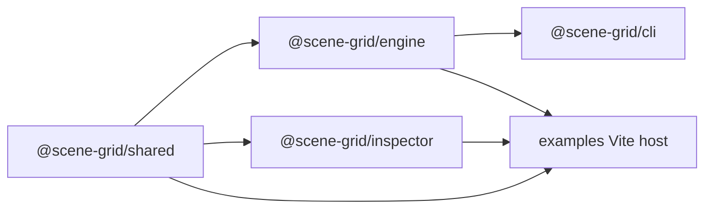
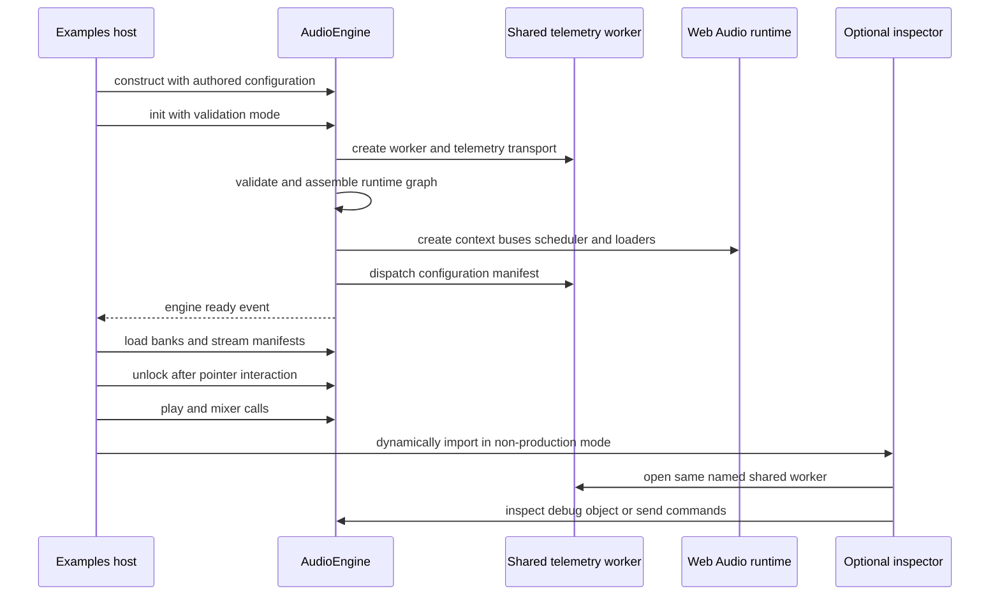

# Repository architecture and runtime boundaries

SceneGrid is an npm workspace for a browser audio runtime. Its production-facing package is `@scene-grid/engine`; `@scene-grid/shared` supplies the lowest-level cross-package utilities; `@scene-grid/inspector` is an optional browser debugging UI; and `@scene-grid/cli` processes audio assets. The `examples` workspace is the integration host rather than part of the engine's runtime dependency graph.

## Workspace responsibilities and public surfaces

| Workspace | Responsibility | Consumer-facing surface |
| --- | --- | --- |
| `@scene-grid/shared` | Dependency-free common types, utilities, telemetry contracts, and the shared-worker factory. | Its root export provides branded/music/condition/culling and inspector-command types; memory, math, guard, immutability, and typed-object helpers; telemetry types; and `createTelemetryWorker()`. |
| `@scene-grid/engine` | Browser audio application façade and its domain, kernel, and infrastructure implementation. | `AudioEngine`, configuration and registry types, selected domain types/enums, `WorkletLoader`, and a small set of infrastructure types. Consumers do not need to import internal layer paths. |
| `@scene-grid/inspector` | Optional diagnostics and control UI. | `attachDebugUI()` builds analyzer views from `audioEngine._debug`; `initAudioDebugPanel()` builds the interactive debug pane. |
| `@scene-grid/cli` | Node command-line asset pipeline and alias preparation. | The `scenegrid` executable resolves configuration, runs the asset pipeline, and exits nonzero on failure. |
| `examples` | Vite browser host and reference integration. | It owns authored audio configuration and creates, initializes, unlocks, loads, and drives an `AudioEngine`. |

The package manifests make `shared` a dependency of both engine and inspector. The inspector has no declared engine package dependency; it accepts an engine-shaped object and its debug proxies at its integration boundary. The example workspace depends on all three browser packages, while the CLI depends on the engine package.

This diagram shows declared workspace package dependencies, not runtime object ownership.

## Internal dependency boundaries

The engine is deliberately layered rather than a collection of mutually reachable modules:

- **Domain** expresses audio behavior and ports. It must not depend on `Infrastructure`, including its debug code.
- **Kernel** contains low-level RTPC/core capabilities and must not depend on `Domain`, `Application`, or `Infrastructure`.
- **Infrastructure** implements technical integrations such as Web Audio context and nodes, loading, scheduling, telemetry transports, and command reception. It may depend on domain and kernel code but must not depend on application orchestration.
- **Application** is the composition root. `AudioEngine` may assemble the lower layers but may not import the package entrypoint, preventing a reverse public-API dependency.
- **Shared** must not import engine or inspector implementation code. Circular dependencies are errors under the architecture lint configuration.

These restrictions are enforced by `npm run lint:architecture`, which runs dependency-cruiser over `packages/engine/src`; the root also provides build, test, typecheck, formatting, lint, and mutation-test commands.

## Browser bootstrap and steady-state path

The example demonstrates the intended ownership boundary: the host authors manifests, buses, snapshots, sound map, RTPC manifest, events, banks, music FSM, size/quota, and voice-limit configuration. It augments `SceneGridRegistry` for application-specific identifier autocomplete, constructs `AudioEngine`, subscribes to lifecycle events, and calls `init({ isStrictValidation: false })`.

This diagram covers the reference host's startup and the optional development inspection path. `unlock()` resumes the audio context, so the example defers it to its one-time `pointerup` handler. It also suspends on hidden documents and attempts to unlock again when visible.

### `AudioEngine` lifecycle, configuration, and failure semantics

`AudioEngine` deep-freezes a shallow copy of its initial configuration. Calling `init()` again after successful initialization is a no-op. On its first call, it creates a named `SharedWorker` and `WorkerTelemetryTransport`, validates configuration through console and telemetry reporters, then composes the context manager, ticker, automation, buffers, bus graph, router, controller, RTPC and instance binder, sequencer, mixer snapshots, bank manager, event/scatterer orchestration, culling, telemetry snapshotter, and—when configured—the music conductor. The ticker owns recurring work for telemetry, state snapshots, RTPC propagation, sound control, culling, mixer transitions, scatterers, events, and optional music.

Validation deliberately has two paths:

- With strict validation, an invalid configuration emits `engine:error` with `INIT_FAILED` and returns before building the audio graph.
- Without strict validation, initialization logs a warning and continues. Any exception while assembling the graph emits `engine:error` and is rethrown; only a completed assembly sets the initialized flag, dispatches the manifest to telemetry, and emits `engine:ready`.

The façade groups public operations by domain: event subscription and posting, RTPC parameters, mixer states/modifiers, music sequencing, listener and sound spatialization, bank and stream management, and play/stop/pause/resume plus context unlock/suspend. Banks cannot load or unload before initialization, and their pre-init state is `UNLOADED`. Loading banks—not `init()`—drives the load lifecycle events; loader failures are surfaced as `engine:error` with `DECODE_ERROR`.

### Telemetry worker and inspector bridge

`createTelemetryWorker()` constructs a module `SharedWorker` from the shared package. It can send `INIT_CONFIG` when `remoteSyncUri` is configured. The worker shares the latest manifest, validation/RAM reports, snapshot, and up to 200 lifecycle/cause-chain logs with newly connected ports. If remote synchronization is configured, it forwards data over a WebSocket, replays buffered state after connection, relays received commands to ports, and reconnects with exponential backoff capped at 30 seconds.

In a non-production engine build, `init()` additionally makes an inspector command port and ticks a `CommandReceiver` on the engine ticker. That receiver can invoke event, snapshot, RTPC/switch override, global playback, loop, and music-transition actions against the assembled runtime. This is separate from the inspector's direct UI integration: `attachDebugUI()` reads `audioEngine._debug`, while the React-oriented inspector hooks open the same named shared worker to consume telemetry and transmit commands. The engine package itself does not import the inspector package.

`AudioDebugger` is intentionally resilient at the DOM boundary. It warns and returns if its wrapper selector finds no element; otherwise it clears the wrapper and creates spectrum and meter views for the master node and every active bus analyzer tap. `initAudioDebugPanel()` similarly warns when it cannot find an engine instance.

## Change and operations guidance

- Keep reusable types and helpers in `shared` only when they can remain isolated from engine and inspector implementations. A new shared-to-engine import violates the architecture policy.
- Keep browser integration in infrastructure and have application wire it. Do not make domain or kernel code reach into Web Audio, telemetry, or debug implementation modules.
- Treat `AudioEngine.config` as immutable normal-runtime input. The underscore-prefixed `_hotReloadConfig()` is an internal HMR API; it revalidates then updates selected bus, snapshot, RTPC, and sound-map state without stopping the context.
- Load required banks and stream manifests after `init()` and before expecting buffer-backed playback. A missing sound buffer produces a warning and a reserved placeholder instance.
- Run `npm run lint:architecture` when moving engine code across layers, and use root `test`, `typecheck`, `lint`, and `build` commands for integration changes. The focused `AudioEngine` tests cover repeated initialization, strict/non-strict validation, RTPC initialization, event subscription, and bank-load lifecycle behavior.

## Related documentation

- [Quickstart](../quickstart.md)
- [Engine overview](../engine/overview.md)
- [Inspector overview](../inspector/overview.md)
- [Example runtime](../examples/runtime.md)
<!-- openwiki: broken internal link [../cli/asset-pipeline.md] file "../cli/asset-pipeline.md" does not exist. Fix the href or restore the target, then delete this comment. -->
- [Asset pipeline](../cli/asset-pipeline.md)
