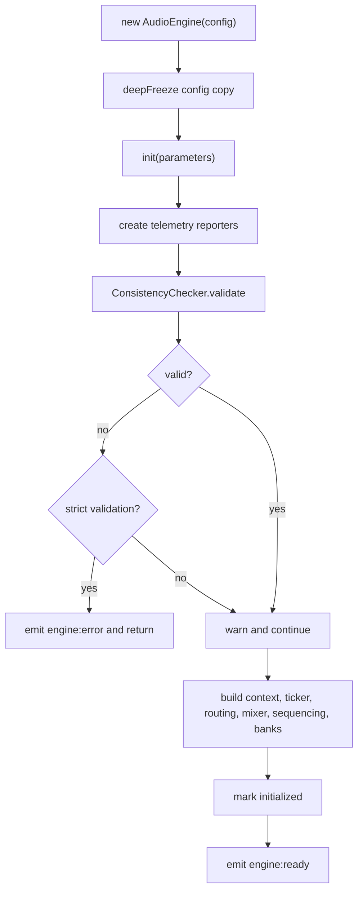

# AudioEngine Application Facade

`AudioEngine` is the application-layer object that composes the engine runtime and presents the public API used by callers.
It sits above configuration, orchestration, validation, and infrastructure boundaries, and it is the place where the runtime graph is assembled.

## What it composes

At construction time, `AudioEngine` stores a deep-frozen copy of the supplied `IAudioEngineConfig`.
The configuration includes the manifest, buses, snapshots, sound map, events, banks, and optional RTPC, music FSM, voice-limit, seed, RAM quota, precomputed sizes, and sequencer PPQN settings.

During initialization it wires together the main runtime subsystems, including:

- `AudioContextManager` and `EngineTicker` for audio-context control and scheduled ticking;
- `RTPCManager` and `InstanceRTPCBinder` for game-parameter control;
- `AudioBusSystem`, limiter, sidechain, and mixer orchestration objects for output routing;
- `SoundRegistry`, `SoundPoolManager`, `SoundController`, and `AudioRouter` for playback and resource lookup;
- `Sequencer`, `AudioEventOrchestrator`, `ScattererOrchestrator`, and optional `MusicConductor` for orchestration;
- `MixerSnapshotManager` and mixer transition machinery for snapshot state;
- `BankManagerAdapter` for bank loading and unloading;
- `TelemetryDispatcher`, reporters, and telemetry worker transport for validation and runtime reporting;
- `CullingRunner` and `VoiceCullingArbiter` for voice-management pressure handling.

## Lifecycle and initialization gate

`init()` is the main lifecycle gate. It is idempotent after successful initialization, and the bank API and event posting are guarded until initialization completes.
Validation happens before the runtime graph is fully activated, so bad configuration is detected early.
If strict validation is requested and the config fails validation, initialization aborts with an `engine:error` event and the runtime graph is not completed.

The initialization sequence also attaches lifecycle events from the audio context:
when the context moves to `suspended`, the engine emits `state:suspended`, and when it moves to `running`, it emits `state:resumed`.

## Public API surface

`AudioEngine` exposes grouped facades rather than a flat set of low-level primitives:

- `events`: `on`, `off`, `once`, and `clear` for engine lifecycle and runtime notifications;
- `params`: `set` and `get` for RTPC/game parameters;
- `mixer`: `setState`, `addModifier`, and `removeModifier` for snapshot control;
- `music`: `playLoop`, `stopLoop`, `playStinger`, and `transitionTo` for sequenced music control;
- `conductor`: `start` for music-conductor workflows when a music FSM is configured;
- `spatial`: listener position/orientation and sound-instance position updates;
- `banks`: `load`, `unload`, and `getState` for bank lifecycle management;
- `config`: the immutable runtime configuration snapshot.

The facade methods are thin delegation layers over the underlying subsystems.
For example, `spatial.setSoundPosition()` accepts either one playback id or an array and forwards each target to the `SoundController`.
The `mixer.setState()` helper always targets the base scene layer, while `addModifier()` and `removeModifier()` manage overlay layers.

## Bank access behavior

Bank operations are intentionally gated by initialization.
Before the engine is initialized, `banks.load()` and `banks.unload()` return without side effects, and `banks.getState()` reports `UNLOADED`.
After initialization, the methods delegate to `BankManagerAdapter`.
This keeps callers from observing partial startup state and avoids bank-side effects before the runtime graph exists.

## Failure and reporting behavior

Validation failures are reported through the configured reporters during startup.
If initialization throws after runtime construction begins, the engine emits `engine:error` with `INIT_FAILED` and rethrows the original error.
Bank decode failures emit `engine:error` with `DECODE_ERROR`, and bank progress and completion are surfaced through `load:start`, `load:progress`, `load:complete`, and `unload:complete` events.

## Debug and operations surface

In non-production environments, initialization also installs an inspector command receiver and exposes a private `_debug` object for tests and inspection.
That debug surface is not the main API, but it is useful for operational introspection and focused validation.

## Representative tests

`packages/engine/src/Application/__tests__/AudioEngine.test.ts` covers the behaviors that matter most here:

- strict and non-strict validation startup paths;
- bank loading, unloading, and `getState()` before and after initialization;
- lifecycle events emitted from audio-context state transitions;
- delegation from the façade methods to routing, mixer, sequencer, and RTPC subsystems;
- failure reporting for invalid startup and bank decode errors.

## Relationship to adjacent pages

This page documents the application façade specifically.
The domain pages describe the collaborators `AudioEngine` composes, while the infrastructure overview explains the runtime services that are instantiated inside the initialization sequence.
