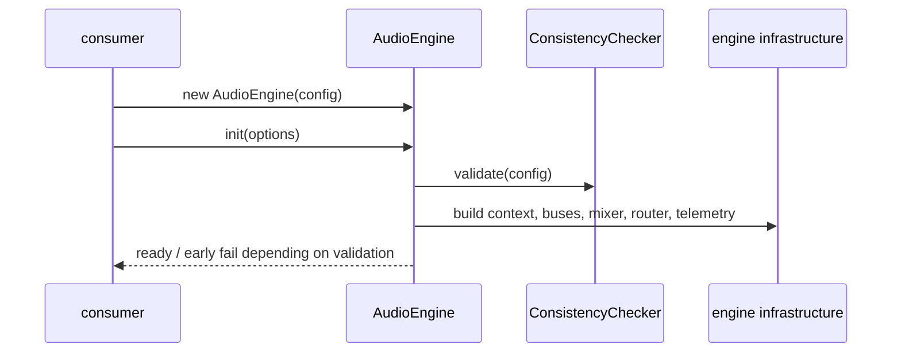

# Audio engine façade

`AudioEngine` is the primary runtime object exported by the engine package.

## Public API families

- `events`: subscribe to engine lifecycle events.
- `params`: read and write RTPC/game parameters.
- `mixer`: set snapshots and mix modifiers.
- `music`: control loops, stingers, and music transitions.
- `conductor`: start music-conductor workflows.
- `spatial`: update listener and sound positions.
- `banks`: load, unload, and inspect bank state.
- `config`: the frozen runtime configuration passed at construction time.

## Initialization lifecycle

1. Freeze the supplied config.
2. Create telemetry and reporters.
3. Run `ConsistencyChecker.validate`.
4. Decide whether startup may continue based on validation mode.
5. Create the engine ticker, context manager, bus system, routing, RTPC, mixer, and orchestration subsystems.
6. Mark the engine initialized and expose runtime facades.

## Important invariants

- `init()` is idempotent once the engine is initialized;
- invalid configuration is reported before the runtime graph is fully activated;
- the config object is deep-frozen to avoid accidental mutation;
- banks and other runtime actions are gated until initialization completes;
- the debug surface is intentionally separate from the production API, but the engine still exposes the internal `_debug` object used by the inspector and tests.

## Downstream dependencies

`AudioEngine` composes many domain and infrastructure collaborators, including the sound registry, routing policies, bus system, RTPC manager, sequencer, culling runner, telemetry dispatcher, and plugin factory.

## Representative tests

- `packages/engine/src/Application/__tests__/AudioEngine.test.ts`

## Scope boundary

This page is the canonical home for the engine façade. The package overview maps the exported surface, while the domain and infrastructure pages document the collaborators it composes.
