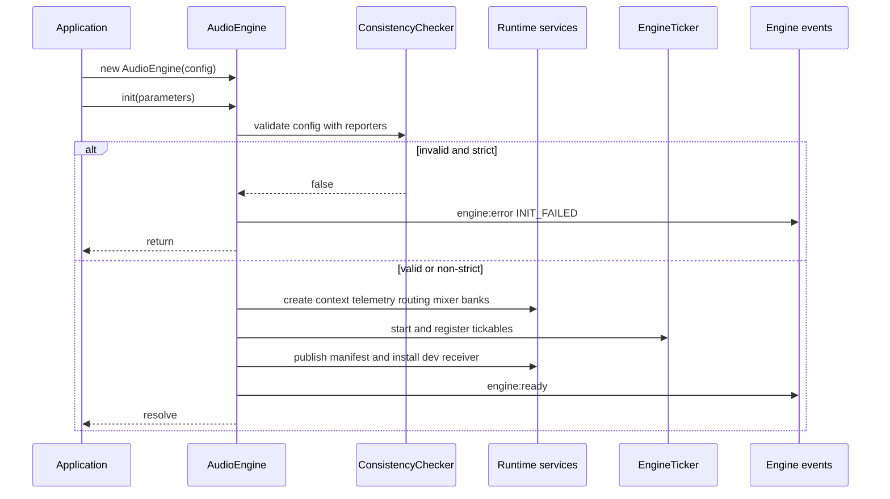

# AudioEngine facade and lifecycle

`AudioEngine` is the application-layer composition root exported by `@scene-grid/engine`. Consumers construct it with the aggregate `IAudioEngineConfig`, call `init()`, then use a deliberately high-level façade for playback, events, parameters, mixer state, music, spatial positioning, asset banks, and stream manifests. Internal Web Audio, routing, mixing, orchestration, loading, telemetry, and culling collaborators remain implementation details.

## Construction and configuration

The constructor assigns `config` to `deepFreeze({ ...config })`. The top-level object is copied before freezing; nested values are shared with the input object and recursively frozen. Callers should therefore treat both the supplied configuration graph and `engine.config` as immutable after construction.

`IAudioEngineConfig` requires the sound `manifest`, `buses`, `snapshots`, `soundMap`, `events`, and `banks`. It can additionally configure RTPCs, a music FSM, global voice count, deterministic seed, buffer RAM quota, precalculated asset sizes, sequencer PPQN, and a telemetry `remoteSyncUri`.

The engine barrel exports `AudioEngine` and the configuration and identifier types. Applications can extend `SceneGridRegistry` by declaration merging so façade identifiers are inferred from their authored configuration; the example application demonstrates that pattern.

## Initialization contract and order

`init(parameters?)` is the composition gate. A call made **after successful initialization** returns immediately because `#isInitialized` is set only near the end of the successful path. There is no initialization-in-progress lock: do not call `init()` concurrently. A strict-validation early return or a thrown initialization error leaves the flag false, so a later call can attempt setup again; there is no teardown or rollback of services already created before an exception.

Initialization first creates a shared telemetry worker and dispatcher (passing `remoteSyncUri` when configured), then validates the frozen configuration with both console and telemetry consistency reporters. Invalid configuration has two modes:

- with `isStrictValidation: true`, it emits `engine:error` with `INIT_FAILED` and `Strict validation failed`, then returns without constructing the runtime graph;
- otherwise, it warns and continues building the graph.

After validation, the façade creates the context at 44,100 Hz, forwards context state changes as lifecycle events, starts the `EngineTicker`, and builds the dependency graph in dependency order. This includes the PRNG, automation and spatial setup, buffer loader, master output and RTPC manager; sound registry/pool/controller and router; bus system; sequencer and mixer snapshot machinery; bank and event orchestration; optional music conductor; telemetry snapshotting; and culling. It then registers the tick-driven services, marks the engine initialized, publishes the configuration to telemetry, optionally installs development commands, and emits `engine:ready`.

Caption: startup validates before composing the runtime graph; strict invalid configuration is the only non-throwing early exit.

### Ticker ownership

The ticker is started before most collaborators are assembled, but runtime tasks are added only after their dependencies exist. It drives telemetry dispatch, telemetry snapshots, RTPC updates, bus RTPC application, per-instance RTPC binding, sound control, culling, mixer transitions, scatterer and audio-event orchestration, and—when `musicFSM` is configured—the music conductor. A mixer transition start also forces an immediate culling tick. Streaming instances receive their own ticker task and remove/dispose themselves when they emit `ended`.

This façade wiring is the integration boundary between [scheduling and culling](../infrastructure/scheduling.md), [telemetry transports](../infrastructure/telemetry.md), and the domain services; those pages own the detailed behavior of the individual services.

## Public controls

The interface is intentionally grouped rather than exposing the graph directly.

| Surface | Behavior |
| --- | --- |
| `play`, `stop`, `pause`, `resume` | Delegate direct sound or playback-id control to `AudioRouter`. `play` returns one id, multiple ids, or `null` when playback is rejected. Prefer `postEvent()` when behavior should be data-driven. |
| `postEvent(eventId)` | Delegates to `AudioEventOrchestrator` only after initialization. Before that it warns and has no side effect. |
| `events` | Provides typed `on`, `off`, `once`, and `clear` subscription operations backed by the engine dispatcher. |
| `params` | Gets and sets RTPC values through `RTPCManager`. |
| `mixer` | `setState()` activates a snapshot on the base `scene_main` layer at `BASE` priority; modifiers activate and clear independent overlay layers. |
| `music` and `conductor` | `music` delegates loops, stingers, and transitions to `Sequencer`. `conductor.start()` is a no-op unless a configured music FSM caused a conductor to be created. |
| `spatial` | Updates listener position/orientation through the context manager. `setSoundPosition()` accepts one playback id or an array and applies the position to every id. |
| `banks` | Loads, unloads, and queries `BankManagerAdapter`; operations before init are no-ops and `getState()` returns `UNLOADED`. |
| `streams` | Fetches and caches the JSON stream manifest referenced by a sound's first URL. Loading an absent sound id or failed response rejects; repeated loads of a cached URL do not refetch. `unload()` evicts the cached manifest and silently ignores an unknown sound id. |

`unlock()` resumes the audio context for a user-gesture flow and `suspend()` suspends it. The example initializes non-strictly, loads banks and a stream manifest, then calls `unlock()` on `pointerup`; it maps document visibility changes to `suspend()` and `unlock()`.

## Events, errors, and operational signals

Subscribe before initialization if the application needs to observe startup failure or readiness. `engine:ready` is emitted only after `#isInitialized` is true and contains a `performance.now()` timestamp and the actual context sample rate. Context transitions are translated to `state:suspended` and `state:resumed`.

Bank callbacks are adapted into `load:start`, `load:progress`, `load:complete`, and `unload:complete`. Per-resource decode failure also emits `engine:error` with `DECODE_ERROR`; progress emits a RAM report through telemetry. The buffer-loader emergency-eviction callback logs the condition and emits a `CAUSE_CHAIN` telemetry packet identifying `RAM_QUOTA_MANAGER` and `OOM_CRITICAL_EVICTION`.

An exception during runtime construction emits `engine:error` with `INIT_FAILED`, including the original error in `details`, and is rethrown. In contrast, stream-manifest fetch errors simply reject `streams.load()`; they do not pass through the engine event dispatcher.

See [domain validation](../domain/validation.md) for rule and reporting detail, and [loaders and sound control](../infrastructure/loader.md) for bank state and asset cleanup behavior.

## Development-only command bridge and diagnostics

When `process.env.NODE_ENV !== 'production'`, initialization builds an `IInspectorDebugPort`, constructs a `CommandReceiver` on the telemetry worker's `MessagePort`, and ticks it with the engine. Incoming messages are queued and processed on the next tick rather than executed in the message listener. Supported inspector commands fire events, apply a base snapshot, override RTPCs or switches, stop/pause/resume all sounds, clear overrides, and control music loops and transitions. Command execution errors are caught and logged by the receiver.

`_debug` exposes internal references—configuration, bus system, master output, RTPC manager, router, context manager, snapshot manager, pool manager, layer stack, and event orchestrator—for tests and inspection. It is not part of `IAudioEngine` and should not be application runtime code’s dependency boundary.

## Hot configuration reload

`_hotReloadConfig(newConfig)` is an internal HMR API, not a general reinitialization or transactional configuration API. It first returns if the engine is not initialized, then validates the candidate using the reporter instances created during `init()`. Failed validation logs an abort and does not change configuration.

For a valid candidate, it immediately replaces `config` with a frozen shallow copy, initializes RTPC definitions only if `rtpcManifest` is present, awaits `AudioBusSystem.updateConfig(newConfig.buses)`, updates snapshot definitions, and replaces the router's sound map. It deliberately does **not** recreate the audio context, ticker, bank manager, sound registry/pool, event orchestrator, sequencer, or music conductor. The example accordingly reloads only buses, snapshots, sound map, and RTPC manifest while retaining the rest of `audio.config`.

The apply sequence has no rollback. If bus update or a later step throws, the method catches and logs the error, but `config` may already reference the new graph and earlier subsystem changes may remain. Safe HMR changes must therefore be limited to the live-updated slices and must tolerate partial application; use a new `AudioEngine` instance for topology changes such as banks, events, manifests, or music FSM.

## Focused tests

`packages/engine/src/Application/__tests__/AudioEngine.test.ts` verifies the façade boundary rather than every collaborator’s implementation. Its high-value cases cover strict/non-strict validation, post-init idempotence, context and bank events, bank gating and state changes, direct-control delegation, RTPC setup, music-conductor conditional wiring, spatial fan-out, stream cache/error/lifecycle behavior, dev command-port wiring, ticker registrations, telemetry on memory eviction, and HMR validation/apply/error paths.

## Related pages

- [Engine package overview](../overview.md) maps the public package surface.
- [Example app runtime](../../examples/runtime.md) shows the browser bootstrap, unlock, visibility, inspector, and HMR usage sequence.
- [Domain validation](../domain/validation.md), [loaders and sound control](../infrastructure/loader.md), [scheduling and culling](../infrastructure/scheduling.md), and [telemetry transports](../infrastructure/telemetry.md) document the principal collaborators composed here.
