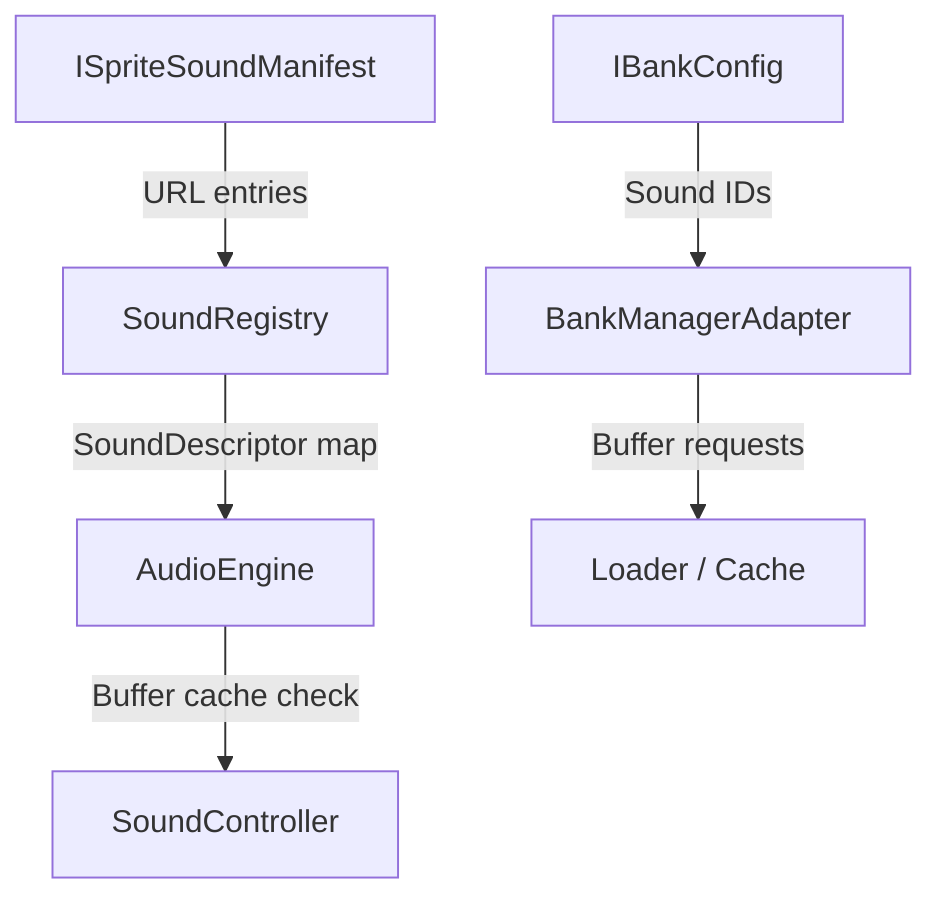

# Configuration and Sound Registry

The configuration layer of the OpenWiki audio engine defines domain input contracts, asset manifests, sound registries, and bank management systems. It provides the structured foundation for authored sound behavior, event sequencing, parameter control (RTPC), music finite state machines (FSM), and audio asset streaming.

## Domain Configuration Ports

The domain configuration layer specifies immutable TypeScript interfaces (`Ports`) modeling authored audio assets and game wiring:

- **`IBankConfig` & `IBankManifest`**: Models sound banks as named collections of sound IDs. `IBankConfig` defines an identifier and a readonly array of `SoundId` values (`repo://packages/engine/src/Domain/Configuration/Ports/IBankConfig.ts`). `IBankManifest` maps bank name strings to bank configurations.
- **`IEventConfig`**: Wraps an ordered readonly list of game audio actions (`repo://packages/engine/src/Domain/Configuration/Ports/IEventConfig.ts`). Actions cover sound playback triggers, RTPC parameter updates, music state transitions, mixer bus modifications, bank loading/unloading, and pending-action cancellations.
- **`IMusicFSMConfig`**: Defines music hierarchical state machines containing an initial music state, global transition edges, and per-state nodes with dedicated sequencer regions, optional snapshots, and state-local edges (`repo://packages/engine/src/Domain/Configuration/Ports/IMusicFSMConfig.ts`).
- **`IRTPCConfig`**: Binds game parameters to curve definitions or presets, supporting optional send targets, smoothing times, and target properties (`repo://packages/engine/src/Domain/Configuration/Ports/IRTPCConfig.ts`).
- **`ISoundConfig` & `ISoundMap`**: `ISoundMap` indexes sound definitions by `SoundId`, resolving each to an `AnySoundConfig` union member (`repo://packages/engine/src/Domain/Configuration/Ports/ISoundMap.ts`, `repo://packages/engine/src/Domain/Configuration/Ports/ISoundConfig.ts`). The sound-config union supports basic, smart-loop, container, layered, switch, and scatterer variants that can reference other sound IDs.

## Manifests and Registries

Audio assets are registered and loaded via manifest abstractions:

- **`ISpriteSoundManifest`**: Associates each `SoundId` with one or more asset URLs and optional loading priority (`repo://packages/engine/src/Domain/Configuration/Ports/ISpriteSoundManifest.ts`).
- **`IStreamManifest`**: Defines streaming asset structures fetched dynamically for long audio files or adaptive streams (`repo://packages/engine/src/Domain/Configuration/Ports/IStreamManifest.ts`).
- **`SoundRegistry`**: Maintains a private map of sound descriptors (`Map<SoundId, SoundDescriptor>`) built from sprite-manifest entries (`repo://packages/engine/src/Domain/Configuration/SoundRegistry.ts`). It exposes the registry map via `.registry` and throws an error (`Sound "<id> not registered"`) when an unregistered identifier is requested.

## Audio Engine Configuration and Initialization

`IAudioEngineConfig` defines the aggregate authored configuration required by `AudioEngine`, including manifests, buses, snapshots, sound maps, events, and banks, alongside optional RTPCs, music FSMs, memory limits, and telemetry URIs (`repo://packages/engine/src/Application/Ports/IAudioEngineConfig.ts`).

During initialization (`AudioEngine.init()`):
1. **Validation**: The engine validates the aggregate configuration against strict or non-strict rules (`repo://packages/engine/src/Application/AudioEngine.ts`). In strict mode, validation failures emit an `engine:error` event with `INIT_FAILED` and halt initialization.
2. **Sound Registry Creation**: A `SoundRegistry` is constructed from sprite-manifest URLs and supplied to the `SoundController`. Registry membership verifies descriptor presence but does not guarantee that decoded audio buffers are already loaded in memory.
3. **Streaming Management**: `AudioEngine.streams.load(soundId)` fetches and caches `IStreamManifest` JSON payloads from sprite-manifest URLs (`repo://packages/engine/src/Application/AudioEngine.ts`). `SoundController` prioritizes cached stream manifests over decoded PCM buffers when playing stream-backed sound descriptors.

## Bank Management (`BankManagerAdapter`)

`BankManagerAdapter` coordinates sound bank lifecycles (`repo://packages/engine/src/Infrastructure/loader/BankManagerAdapter.ts`):
- **Loading**: Joins bank-owned sound IDs with sprite manifests to generate buffer load requests with correct priority and estimated asset size. Unknown IDs are skipped; banks with zero loadable entries instantly transition to `LOADED`.
- **Unloading**: Stops active bank sounds immediately without audio tails, purges pooled instances and cached URLs, and transitions state to `UNLOADED`.
