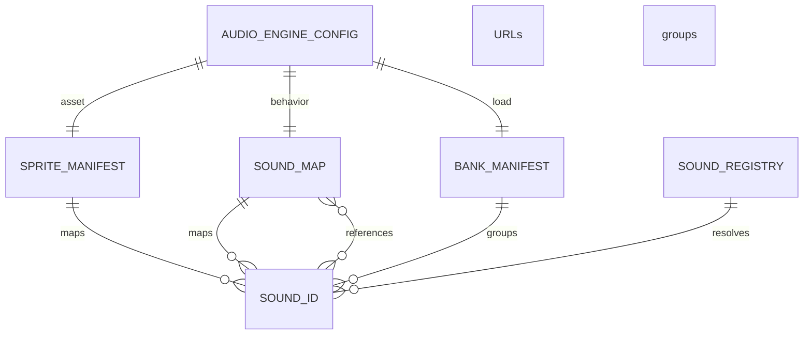

# Configuration registries and asset manifests

Configuration is the authored data boundary for a playable audio engine. `IAudioEngineConfig` aggregates the required asset manifest, buses, snapshots, sound map, events, and banks; RTPC definitions, a music FSM, voice and RAM limits, asset-size estimates, sequencer PPQN, seed, and telemetry URI are optional. The engine freezes the supplied configuration when constructed, validates it at initialization, and uses its pieces to compose the runtime services.

## Asset identity: manifest versus sound map

Two complementary maps use `SoundId` as their join key:

- **`ISpriteSoundManifest` (`manifest`)** maps an ID to one URL or an ordered URL-candidate list, with optional `high` or `low` loading priority. It answers *where the media or stream-manifest resource is*.
- **`ISoundMap` (`soundMap`)** maps the same ID to `AnySoundConfig`. It answers *how that ID should behave*: routing to a bus, looping, voice policy, spatial options, variation, ducking, per-sound RTPC binding, and an optional tail.

`AnySoundConfig` also supports composite behavior. A container selects source IDs by random, no-repeat random, or sequence policy; a switch selects IDs by a game parameter; a layered sound supplies delayed/rated layers; a scatterer schedules sources within a spawn-rate range; and a smart loop defines tempo-aware sample regions and optional magnets. These entries may refer to other `SoundId` values, so all referenced IDs must be present in the manifest or sound map as appropriate.

The example configuration demonstrates the separation: `sound-manifest.json` contains URL candidates, while `SoundMap.ts` assigns the matching IDs to music or SFX buses and defines containers, switches, scatterers, and smart-loop regions. URL candidates provide alternate encodings; the runtime generally selects the first usable URL for loading-related lookups.

Caption: authored maps share `SoundId`; the registry is the runtime URL-descriptor index derived from the sprite manifest.

## Other authored registries

The aggregate config connects media metadata to the systems that can act on it:

- A bank has a `BankId` and readonly sound-ID list. Its manifest is a string-keyed record of banks. Loading a bank looks up each listed ID in the sprite manifest; IDs absent from that manifest do not produce a load request.
- An event is an ordered action list. Actions can control sounds and loops, update an RTPC, transition music, apply mixer state or modifiers, trigger another event, load or unload a bank, or cancel pending tagged work. Optional delay, probability, condition, and tags are common action controls.
- A music FSM has an initial state, global edges, and named state nodes. A node identifies the source sound and sequencer region, optionally activates a snapshot, and owns its own conditional, quantized transition edges. Edges can name a transition region or stinger and specify crossfade and interruptibility.
- `IRTPCConfig` maps a game parameter through a curve or preset to one of the supported sound target properties (`gain`, filter frequency, pan, pitch, or send level), optionally naming a send-target bus and smoothing time. The aggregate configuration accepts the global RTPC manifest separately.

These contracts define IDs and references; they do not load, decode, or retain `AudioBuffer` objects.

## Registry construction and playback boundary

During `AudioEngine.init()`, after validation begins runtime assembly, the engine creates one `SoundRegistry` and registers every entry from `config.manifest`. Each runtime descriptor currently contains `options.url` copied from that manifest entry—descriptors are URL metadata, not decoded audio. The engine passes the registry's map to `SoundController`, while the instance factory calls `SoundRegistry.get(soundId)` to obtain the URLs and asks the buffer loader for a decoded buffer.

`SoundRegistry` is deliberately small:

- `register(id, descriptor)` inserts or replaces the descriptor in its private `Map<SoundId, SoundDescriptor>`.
- `registry` returns that same mutable map, which is used by the controller integration.
- `get(id)` returns the descriptor, but throws `Sound "<id>" not registered` for a missing entry. This catches attempted direct resolution of an ID that was not in the startup manifest.

Registry membership does **not** mean media is ready to play. Bank loading drives decoding into the buffer cache. When the instance factory cannot find a buffer for a registered descriptor, it warns that the corresponding bank should be loaded and creates a reserved, bufferless instance instead. In practical application code, load the bank containing a sound before playback.

## Banks: asset availability lifecycle

`BankManagerAdapter` owns bank state (`UNLOADED`, `LOADING`, `LOADED`, or `ERROR`) and joins the bank manifest with the sprite manifest. For each listed manifest entry it creates a buffer-load request using the asset's priority and a precomputed size keyed by the first URL's filename, falling back to `5.0` MB when no estimate exists. A missing bank only warns and returns; a bank with no loadable entries is marked loaded immediately.

A successful `loadBank()` marks the bank loaded even if individual batch items failed; those failures are reported through the load callbacks. A thrown batch-level error instead marks the bank `ERROR` and is rethrown. `unloadBank()` stops its sounds without tails, purges their pooled instances and cached URLs, marks the bank unloaded, and emits its unload callback. This is why bank membership should include the leaf media IDs that need decoding, not merely a composite sound-map ID.

## Streams are manifest-backed assets

A sound can also point at a JSON stream manifest rather than a directly decoded asset. `IStreamManifest` declares whether playback loops and an ordered set of chunks, each with URL, trim start in samples, and duration in samples.

The `AudioEngine.streams` façade loads this JSON on demand from the sound manifest entry's first URL and caches it by that URL. It rejects an unknown sound ID or non-OK fetch response; a repeated load for the cached URL does not fetch again. `unload(soundId)` removes the cached entry and silently ignores an unknown ID. During engine setup, `SoundController` receives a resolver over this cache; when it finds a stream manifest, its stream factory loads chunks, creates a stream node and instance, ticks the instance, and removes and disposes it when it ends. Therefore `streams.load(soundId)` must complete before a stream-configured sound can resolve its manifest.

## Validation and authoring checklist

Validation is the consistency gate, not the registry. `AudioEngine.init()` runs `ConsistencyChecker` against the aggregate configuration before completing composition. Strict initialization emits `INIT_FAILED` and returns on invalid config; non-strict initialization reports the problems and continues. See [domain validation](validation.md) for the exact rules and severity behavior.

For a valid, playable asset set:

1. Add a unique `SoundId` with a reachable URL or URL candidates to `manifest`.
2. Add matching `soundMap` behavior, including valid buses and any referenced child, tail, switch, layer, or loop IDs.
3. Put leaf media IDs in one or more banks that the application will load; provide `precalculatedSizes` when accurate RAM accounting matters.
4. Add only valid cross-references from events, RTPCs, music states, snapshots, and banks, then run validation.
5. Initialize the engine and await `banks.load(bankId)` before ordinary buffer-backed playback, or await `streams.load(soundId)` before stream-backed playback.

<!-- openwiki: broken internal link [../../cli/asset-pipeline.md] file "../../cli/asset-pipeline.md" does not exist. Fix the href or restore the target, then delete this comment. -->
For generated URLs and size metadata, see the [asset pipeline](../../cli/asset-pipeline.md). The [example runtime](../../examples/runtime.md) shows configuration assembly and runtime loading; [loaders and sound control](../infrastructure/loader.md) documents cache and unload behavior.

## Focused tests

`packages/engine/src/Domain/Configuration/__tests__/SoundRegistry.test.ts` verifies registration and retrieval by identity, the missing-ID error, and exposure of the backing map. Bank, stream-cache, and startup integration behavior is covered at the infrastructure and `AudioEngine` boundaries rather than by this domain unit test.
