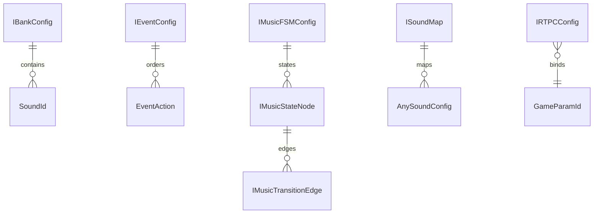

# Domain Configuration and Registry

This subsystem defines the engine’s configuration input contracts and the runtime registry that bridges authored sound manifests to loaded playback descriptors.

## What belongs here

- `ISoundConfig` and `AnySoundConfig` for authored sound entries, including container, switch, layered, scatterer, and smart-loop variants;
- `IBankConfig`, `IEventConfig`, `IMusicFSMConfig`, `IRTPCConfig`, and `ISoundMap` as manifest-facing domain types;
- `SoundRegistry` as the in-memory registry used to resolve `SoundId` values to loaded sound descriptors during initialization and playback.

These types are domain contracts, not example catalogs. They describe what the engine accepts and how authored assets are named and linked before runtime work begins.

## Configuration model

The configuration layer is organized around stable identifiers from `@scene-grid/shared`:

- banks enumerate the `SoundId` values they own;
- events map to ordered action lists that can play, stop, pause, resume, route RTPC updates, manipulate mixer state, trigger other events, and load or unload banks;
- music FSM manifests define an initial music state, a set of global edges, and per-state nodes with their own transitions;
- RTPC manifests bind a game parameter to a curve and optional bus or smoothing settings;
- sound maps associate each `SoundId` with one of the supported sound configuration shapes.

The diagram shows the main manifest relationships the engine consumes before it can start playback.

## Sound registry

`SoundRegistry` is a small runtime lookup layer backed by a `Map<SoundId, SoundDescriptor>`.

- `register(id, desc)` stores a loaded descriptor under a sound ID.
- `get(id)` returns the descriptor for a registered sound.
- `get(id)` throws `Sound "<id>" not registered` when the sound has not been registered yet.
- `registry` exposes the underlying map for consumers that need direct iteration or inspection.

This registry preserves the boundary between authored IDs and resolved runtime values: the engine keeps the source manifest separate from the loaded descriptor objects that playback code needs.

## Lifecycle and invariants

Configuration is consumed before the audio runtime starts its normal work:

1. authored manifests are assembled into domain config objects;
2. validation checks that the configuration is internally consistent;
3. runtime startup resolves sound IDs into registry entries;
4. playback code reads from the registry, not from the authored manifests directly.

The important invariant is that a `SoundId` must be registered before code tries to resolve it through `SoundRegistry.get()`. Missing entries fail fast instead of returning an undefined descriptor.

## Validation boundary

This page stays focused on the shape and consumption of configuration data. Correctness rules such as structural validation, missing references, and cross-manifest consistency are documented on the validation page, where the enforcement gate lives before engine initialization.

## Representative test coverage

- `packages/engine/src/Domain/Configuration/__tests__/SoundRegistry.test.ts` verifies register, retrieval, registry exposure, and the thrown error for missing sounds.
