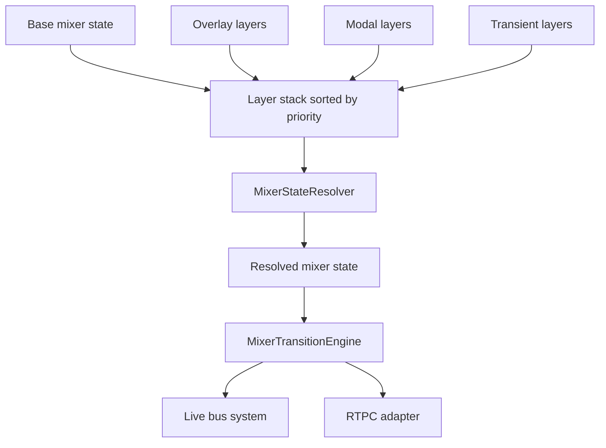
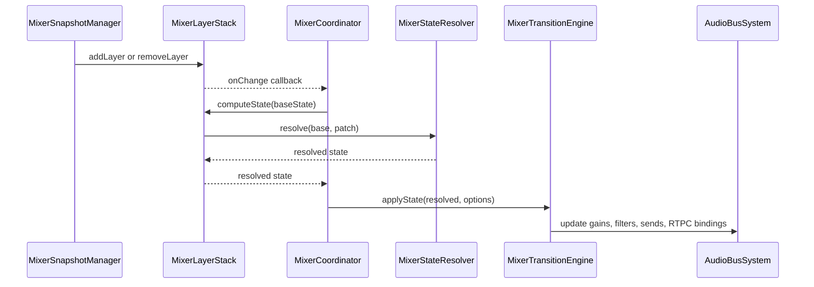

# Domain Mixer and Snapshot Resolution

The mixer domain owns how base mix state and overlay snapshots are layered, resolved, and applied to the live bus system.
It also records the snapshot-change telemetry that accompanies snapshot activation and clearing.

## Core responsibilities

- keep the authoritative base mixer state in the coordinator;
- maintain a priority-ordered stack of mixer layers;
- merge layered snapshots into a resolved mixer state;
- drive the transition engine that applies the resolved state to buses, filters, sends, and RTPC bindings;
- emit mixer snapshot telemetry when snapshots are activated or cleared.

## Runtime architecture

`MixerCoordinator` is the entrypoint that ties the layer stack to the transition engine.
It stores the current base state, asks the layer stack to compute a resolved state from that base, and forwards the result to `MixerTransitionEngine`.

`MixerSnapshotManager` is the public snapshot-control surface used by the engine facade.
It looks up a named snapshot, injects metadata, adds or removes a layer, and then delegates recomputation through the coordinator.
The manager also emits mixer events for snapshot entry, exit, and transition boundaries, and dispatches telemetry packets for snapshot changes.

`MixerLayerStack` owns the active layer collection and the priority ordering used during composition.
Layers are keyed by `LayerId`, sorted from lowest to highest priority, and folded through the resolver one by one.
The exported `PRIORITY` constants provide the common bands used by callers: `BASE`, `OVERLAY`, `MODAL`, and `TRANSIENT`.

`MixerStateResolver` performs the actual merge logic for a base state plus a snapshot patch.
It combines per-bus values, clamps gains to the configured ceiling, carries forward metadata timestamps, and applies explicit clearing semantics for filters, sends, and RTPC bindings.

`MixerTransitionEngine` applies the resolved state to the live `IAudioBusSystem` and RTPC adapter.
It uses a two-phase transition model for non-instant updates and keeps the first application as a cold start.

## Layering and priority model

Layers are evaluated in ascending priority order, so lower-priority layers establish the starting state and higher-priority layers refine or override it.
That ordering matters for scenes such as a base layer plus an overlay UI layer, a modal layer, or a short-lived transient layer.

Caption: layered snapshots are folded from base to highest priority, then applied to the live audio graph.

`clearByPrefix()` can remove multiple layers that share a naming prefix, which is useful for grouped overlays or scoped runtime effects.
It does not emit the stack change callback itself, so callers that rely on a recompute must trigger it separately.

## Snapshot activation semantics

Snapshot activation follows the same basic pattern regardless of source:

1. resolve the snapshot name against the configured `ISnapshots` map;
2. emit `snapshot:enter` and `transition:start` events;
3. dispatch a telemetry cause chain that records the API method, snapshot id, fade time, and current sound-controller time;
4. add the layer with the requested `LayerId` and priority;
5. attach snapshot metadata containing the snapshot id and a fresh timestamp;
6. emit `transition:end`.

When a snapshot is cleared, the manager first checks that the layer exists, then emits `snapshot:exit` and `transition:start`, removes the layer, recomputes the mixer state with the supplied duration, dispatches `CLEAR` telemetry, and finally emits `transition:end`.

The snapshot metadata on each active layer is important for hot module replacement.
`updateSnapshotsConfig()` can swap in a new snapshot table and refresh any active layer whose stored `snapshotId` still exists in the new configuration.

## State resolution rules

`MixerStateResolver` is responsible for the merge semantics that determine the next mixer state.
Important rules include:

- bus gains multiply base and patch values, with a default base gain of `1` unless configured otherwise;
- the resolved gain is clamped to the configured maximum gain limit;
- a patch filter of `null` explicitly clears the filter, while an omitted filter keeps the base filter;
- sends are merged per destination bus, and a `null` send entry removes that destination;
- RTPC bindings are merged per target property, and `null` removes the binding;
- the resolved snapshot metadata keeps the latest snapshot id and receives a fresh timestamp.

## Transition engine behavior

`MixerTransitionEngine.applyState()` first checks whether an active transition is locked against interruption.
If the engine is idle or the requested duration is zero or negative, it performs an instant transition: each bus receives immediate gain and filter updates, send routing is applied without fade, and the current mixer state is replaced immediately.

For timed transitions, the engine enters a filter-fade phase covering the first 25% of the duration.
During that phase it replaces filters only when the new filter differs from the previous one, and it binds RTPCs for the target state.
Once the filter phase ends, it starts the main transition phase for the remaining time and animates gains and sends.
Missing sends from the new target are explicitly cleared so stale routing does not remain active.

`tick()` advances the finite-state machine and completes the transition when the total duration is reached.
`cancelActiveTransition()` abandons the active transition immediately.

Caption: snapshot changes flow from layer mutation through resolution and into live bus updates.

## Telemetry and events

Telemetry is emitted from `MixerSnapshotManager`, not from the resolver or transition engine.
That keeps the state-composition code focused on mixer semantics while the manager records user-facing snapshot operations.
The telemetry packet records the API method name, the target snapshot id or `CLEAR`, the fade time, and the audio-context time converted to milliseconds.

The manager also exposes an event stream with the snapshot and transition lifecycle events that UI or diagnostics code can subscribe to.

## Extension points and operational notes

- Add new snapshot types by extending the snapshot config map; the manager will activate them without extra wiring.
- Add new layer categories by assigning priorities between or beyond the existing bands.
- Tune the resolver with custom default bus gain or max gain limit when the engine needs different mix normalization.
- Preserve the current transition semantics when changing the transition engine, especially cold-start, locked-transition, and send-clearing behavior.

## Representative tests

The behavior that matters most is covered by focused unit tests in the mixer domain:

- `packages/engine/src/Domain/Mixer/__tests__/MixerLayer.test.ts`
- `packages/engine/src/Domain/Mixer/__tests__/MixerSnapshotManager.test.ts`
- `packages/engine/src/Domain/Mixer/__tests__/MixerStateResolver.test.ts`
- `packages/engine/src/Domain/Mixer/__tests__/MixerTransitionEngine.test.ts`
- `packages/engine/src/Domain/Mixer/__tests__/MixerCoordinator.test.ts`

These tests cover priority ordering, snapshot activation and clearing, telemetry dispatch, metadata refresh, merge semantics, cold-start behavior, interruptibility, filter-phase timing, and send cleanup.
