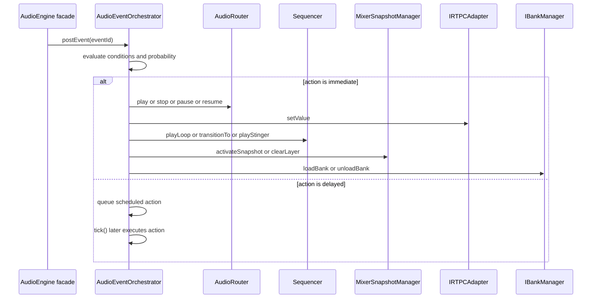

# Domain orchestration

This subsystem owns the runtime coordination layer that turns events, music-state changes, and scatter policies into concrete playback operations.
It is the domain bridge between authored configuration, the router and managers that select playback targets, and the mixer and telemetry surfaces that record or apply the result.

## Owned modules

- `AudioEventOrchestrator`
- `AudioGrid`
- `MusicConductor`
- `MusicFsmEvaluator`
- `ScattererOrchestrator`
- `Sequencer`
- `SmartLoopTransitionPolicy`

## Runtime responsibilities

- translate event actions into router, sequencer, mixer, RTPC, and bank operations;
- evaluate music FSM edges and trigger loop transitions from RTPC-driven conditions;
- keep loop playback, stingers, and snapshot changes aligned to musical time;
- schedule scatter spawning, container selection, and positional placement over time;
- encapsulate quantization, lookahead, and transition policy so callers do not hard-code timing rules.

## Relationship to adjacent subsystems

Orchestration depends on the router and manager pages for selection and playback-side effects, not for policy ownership.
`AudioEventOrchestrator` posts event actions into the router, `Sequencer`, mixer snapshot manager, RTPC adapter, and bank manager after those collaborators are resolved elsewhere.
Likewise, `ScattererOrchestrator` relies on `ContainerPlaybackPolicy` for source choice and on the sound controller for pause, stop, and position updates.

Telemetry is also a cross-cutting concern: the orchestration layer can emit cause-chain or playback-related reporting through the supplied telemetry dispatcher, but the reporting format and transport belong to the application and shared layers.

## Event orchestration

`AudioEventOrchestrator` is the event-runtime entrypoint.
It accepts an authored event map and then executes each action either immediately or after a delay, based on the action configuration and current sound-controller time.
Conditions are evaluated before execution, probability gates can block the action, and delayed actions are queued until `tick()` reaches their scheduled time.

The supported actions show why this class is the orchestration hub rather than a thin dispatcher:

- playback control through `router.play`, `router.stop`, `router.pause`, and `router.resume`;
- RTPC writes through the adapter;
- `Sequencer` calls for `playLoop`, `stopLoop`, `transitionTo`, and `playStinger`;
- mixer snapshot operations for base state and modifier layers;
- bank load and unload operations;
- nested event triggering with a recursion guard to prevent runaway re-entry;
- cancellation of scheduled actions by tag.

Tracked playback entries are cleaned up as the underlying voice or loop state ends, which keeps tagged action bookkeeping from growing indefinitely.

Caption: event actions fan out through orchestration collaborators, with delayed work re-entering through the tick loop.

## Sequenced music control

`Sequencer` manages loop playback as a stateful scheduler.
It maintains per-track contexts, schedules regions with a lookahead window, and interacts with the sound controller for immediate playback, fades, cancellation, and stop timing.
The sequencer depends on the router to resolve sound configuration and on the audio grid to convert between time, beats, bars, and pulses.

Important control-flow points:

- `playLoop()` resets any existing track state before starting a new looping region;
- `stopLoop()` cancels active regions and clears track bookkeeping;
- `transitionTo()` rejects idle tracks and non-interruptible transitions already in flight;
- quantized transitions use `AudioGrid` or a provided grid to align to the next beat, bar, grid division, or exact pulse;
- crossfades, tails, and optional transition regions are assembled into a queue of region-start instructions;
- stinger playback can be aligned to the same quantization source as the reference track.

The sequencer is also where smart-loop timing becomes runtime behavior.
`SmartLoopTransitionPolicy` provides the decision logic that says whether a current region should transition to another region based on magnet conditions and hysteresis, while the sequencer performs the actual timing and playback work.

## Music FSM coordination

`MusicConductor` ties RTPC state, FSM edges, loop playback, and mixer snapshots together.
It is an `ITickable` runtime object that starts from a configured initial state, starts the associated loop when `start()` is called, and stops that loop when `stop()` is called.
During `tick()`, it first applies any pending mixer snapshot activation whose scheduled execution time has arrived, then evaluates transition edges when the conductor is not already transitioning.

Edge evaluation is delegated to `MusicFsmEvaluator`, which checks global edges before state-local edges and returns the first edge whose conditions all pass.
That keeps the conductor focused on lifecycle and execution, while the evaluator owns edge ordering.

When a transition fires, the conductor:

1. asks the sequencer to transition to the target region with the edge quantization, crossfade, and interruptibility settings;
2. optionally schedules a stinger on the same sync rule;
3. schedules a mixer snapshot activation for the target state, using the current time or a quantized target time;
4. updates its internal state machine so it does not re-enter transition logic too early.

The conductor uses a dedicated mixer layer and priority for its FSM snapshot work, which keeps music-state mix changes separate from scene or modifier layers.

## Scatterer behavior

`ScattererOrchestrator` turns a scatterer sound config into repeated spawn sessions.
Each session tracks its own next spawn time, spawned playback ids, and polyphony count.
On each tick, the orchestrator removes sessions whose source playback no longer exists, pauses spawn timing when the logical state is paused, and spawns new voices when the current time reaches the next scheduled time.

Spawn behavior is policy-driven rather than ad hoc:

- source selection comes from `ContainerPlaybackPolicy` in `random_no_repeat` mode;
- positional scatter uses the configured distance range and a random angle on the X/Z plane;
- sync-aware spawn timing can quantize the next spawn to the next beat or bar of a reference track using `Sequencer.getPlaybackInfo()`;
- the configured polyphony cap prevents unbounded voice accumulation.

## Timing model and grid helpers

`AudioGrid` is the shared timing helper used by sequenced orchestration.
It converts the configured BPM, beats-per-bar, PPQN, and start time into musical navigation helpers for:

- the next beat;
- the next bar;
- a specific pulse;
- the pulse at a given time;
- a specific grid division.

The same grid math underpins quantized sequence transitions, stinger alignment, and sync-aware scatter scheduling.

## Important invariants and failure behavior

- Event orchestration must guard against recursive `trigger_event` loops and should drop or log missing event ids rather than inventing actions.
- Scheduled event actions and track sessions must be cleaned up as playback ends so stale work does not keep firing.
- The sequencer should not transition idle tracks, and it should respect non-interruptible transitions already in progress.
- Quantized transitions depend on playback-info availability; when reference playback cannot be resolved, the sequencer falls back to the current time path instead of crashing.
- Music FSM edges are evaluated against current RTPC values, so state changes remain data-driven instead of UI-driven.
- Scatter spawning must respect max polyphony and container-policy outcomes; if no sound is selected, the spawn attempt is a no-op.

## Extension points and operations

- Add new event actions by extending the event action switch in `AudioEventOrchestrator` and keeping delayed execution and telemetry behavior intact.
- Add new musical quantization modes by extending `Sequencer.transitionTo()` and the time-grid helpers together.
- Add new FSM behavior by extending the music config and `MusicFsmEvaluator` edge selection rules.
- Add new scatter behaviors by changing spawn policy, sync quantization, or position calculation, while keeping the active-session lifecycle intact.
- Preserve the conductor’s separation between edge evaluation, sequencer timing, and deferred mixer activation when altering its tick loop.

## Representative tests

The focused tests that exercise the important orchestration behavior are:

- `packages/engine/src/Domain/Orchestration/__tests__/MusicConductor.test.ts`
- `packages/engine/src/Domain/Orchestration/__tests__/Sequencer.test.ts`
- `packages/engine/src/Domain/Orchestration/__tests__/AudioEventOrchestrator.test.ts`
- `packages/engine/src/Domain/Orchestration/__tests__/ScattererOrchestrator.test.ts`
- `packages/engine/src/Domain/Orchestration/__tests__/SmartLoopTransitionPolicy.test.ts`
- `packages/engine/src/Domain/Orchestration/__tests__/AudioGrid.test.ts`
- `packages/engine/src/Domain/Orchestration/__tests__/MusicFsmEvaluator.test.ts`

These tests matter because they cover delayed event execution, recursion guarding, quantized sequencing, mixer snapshot timing, FSM edge ordering, smart-loop magnet decisions, sync-aware scatter spawning, and the musical math that keeps them aligned.
