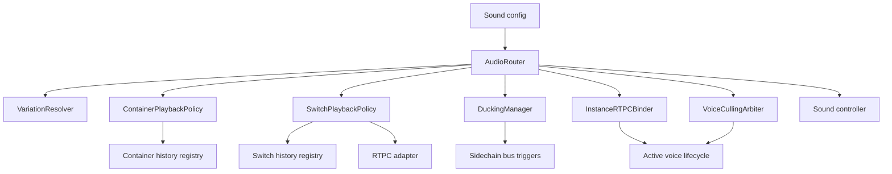
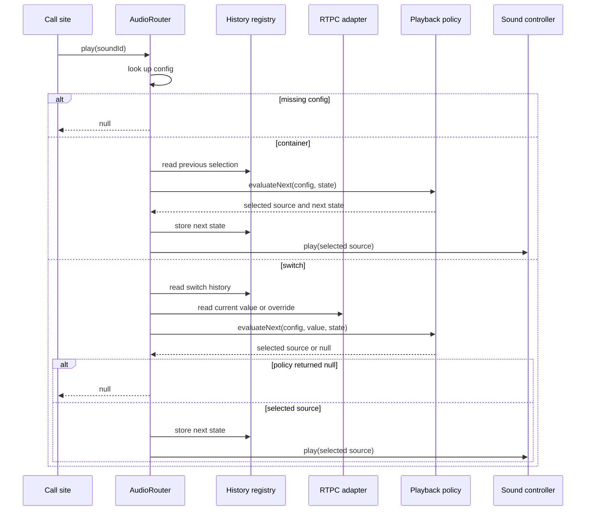

# Router and Playback Managers

This subsystem is the runtime decision layer between authored sound configuration and concrete playback.
It does not own config authoring or low-level sound transport; instead it resolves what should play, what should be vetoed, and which playback-side effects must be attached after selection.

## Runtime role

The router and its managers sit in the middle of the engine's domain graph:
configuration describes candidate sounds, state registries remember prior selections, and the sound controller executes the final play or stop operations.
That means this layer is stateful even when it looks like a pure selector: container history, switch history, active playbacks, and current RTPC values all influence the next decision.

Caption: runtime routing fans out from `AudioRouter` into selection, side effects, and voice-management helpers.

## Owned modules

- `AudioRouter`
- `VariationResolver`
- `ContainerPlaybackPolicy`
- `SwitchPlaybackPolicy`
- `DuckingManager`
- `InstanceRTPCBinder`
- `VoiceCullingArbiter`

## Responsibilities

- resolve a `SoundId` into one or more concrete playback ids or reject it when the registry cannot supply a valid entry;
- choose container sources using policy plus history so repeated plays can avoid or repeat candidates according to mode;
- select switch targets from numeric thresholds or localized overrides, then persist the resolved switch state;
- apply per-playback variation, ducking, RTPC binding, and bus routing after the target is selected;
- keep voice culling separate from route resolution while still allowing bus pressure and voice state to suppress or restore playback.

## Routing flow and veto paths

`AudioRouter.play()` is the main entrypoint.
It first validates that the requested sound exists in the sound map, and it refuses to play missing ids rather than inventing a fallback.
The router then branches by authored sound shape:

- containers delegate to `ContainerPlaybackPolicy` and update container history;
- layered sounds expand into multiple child playbacks;
- switch sounds resolve through `SwitchPlaybackPolicy` using the current RTPC value or a localized override plus switch history;
- scatterers are handed to the scatterer orchestrator, and if that orchestrator is unavailable the router returns `null` and reports the failure;
- ordinary sounds run through `VariationResolver` before being scheduled on the sound controller.

The tests show that these veto paths are not theoretical:
missing config yields a no-op, scatterer playback is blocked until the orchestrator exists, switch resolution can return `null` without falling back to an arbitrary asset, and recursion depth is capped so cyclic container definitions cannot loop forever.

Caption: routing depends on history and current state, and it can fail closed when selection cannot be resolved.

## Selection policies

`ContainerPlaybackPolicy` is responsible for choosing the next source inside a container, not for starting playback itself.
It supports three modes:

- `sequence`, which advances by index and wraps around;
- `random`, which uses weighted random selection;
- `random_no_repeat`, which keeps resampling until the selected index is not in the recent-history window.

The policy also returns the next container state, which is why the router can persist history after selection and make the next play depend on the previous one.
If a container has no sources, the policy returns `soundId: null` and resets the state to `lastPlayedIndex: -1`.

`SwitchPlaybackPolicy` follows a similar pattern for switch-based routing.
Numeric values select the highest configured threshold at or below the current value, string values act as explicit keys, and the configured default switch is only used when the selected key has no explicit mapping.
Hysteresis makes the policy history-sensitive: if the current value sits near a boundary, the policy can preserve the previous switch key instead of flipping immediately.
That matters because the router persists the returned state back into the switch registry, so future evaluations can see the prior key.

## Variation and playback wiring

`VariationResolver` is a pure option transformer.
It does not choose the target sound, but it can perturb rate, volume, and seek offset when the source config carries variation settings.
The router applies the resolver before delegating to `SoundController.play()`, which means runtime variation is part of the play request and not an afterthought.

After a playback is created, `AudioRouter.applyConfigToPlayback()` performs the post-selection wiring that the controller itself does not infer from the sound id alone:

- route the voice to a bus when the config declares `busId`;
- trigger ducking against one or more target buses when the config carries ducking metadata;
- bind RTPC targets so voice parameters track game-parameter changes over time.

This division keeps selection policy separate from side effects while still ensuring that one play request can fan out into routing, ducking, and parameter binding.

## Ducking, RTPC binding, and lifecycle cleanup

`DuckingManager` is a thin sidechain trigger adapter.
It converts a single bus or a bus list into `addSidechainTrigger()` calls on the sound controller, and it falls back to intensity `1` when the intensity list is shorter than the bus list.
That makes ducking a configurable post-selection effect rather than a special case in the router.

`InstanceRTPCBinder` manages per-voice RTPC bindings.
It accepts a config map for supported voice targets, creates active bindings, applies the mapped parameter value immediately, and re-applies them later in `tickRTPC()`.
It also registers an `onVoiceEnded()` cleanup hook so bindings are removed when the voice dies, which prevents stale instance state from accumulating across playback lifecycles.

`VoiceCullingArbiter` watches active playbacks against bus volume and physical state.
When a bus stays below the culling threshold long enough, it marks voices for virtualization after the hysteresis window; when the bus becomes audible again, it marks virtual voices for devirtualization if their logical state is still playing.
Ghost voices are skipped, and playbacks that disappear from the active list are removed from the mute timer map.
The arbiter therefore acts as a pressure-management gate around the router's output, not as part of sound selection itself.

## Important invariants and failure behavior

- Missing sound ids are rejected early, so the router does not synthesize fallback content.
- Container and switch selection depend on history registries, so replay behavior is intentionally stateful.
- Switch selection can legitimately return `null`, and the router treats that as a non-play result instead of forcing a default asset.
- Recursion depth is capped to prevent self-referential container graphs from looping forever.
- Ducking and RTPC binding only happen after a concrete playback target exists.
- Culling decisions depend on active playback state and bus volume, which means voice management is reactive to runtime pressure rather than static config alone.

## Extension points and operations

- Add a new routing shape by extending `AudioRouter.play()` and preserving the existing fail-closed behavior for missing or unresolved configs.
- Add new container behavior by extending `ContainerPlaybackPolicy` while continuing to return both the selected source and the next history state.
- Add new switch behavior by extending `SwitchPlaybackPolicy` and keeping the registry-backed state update path intact.
- Add new post-selection side effects by expanding `AudioRouter.applyConfigToPlayback()` rather than mixing those effects into selection policy.
- Tune culling behavior by adjusting the threshold, hysteresis, or pool size in `VoiceCullingArbiter` without changing the router's selection logic.

## Representative tests

Focused tests document the behaviors that matter most here:

- `packages/engine/src/Domain/Router/__tests__/AudioRouter.test.ts`
- `packages/engine/src/Domain/Managers/__tests__/DuckingManager.test.ts`

Those tests cover missing-config vetoes, switch fallbacks and null results, recursive container protection, tail playback behavior, multi-bus ducking, and the post-selection wiring that ties the router to the sound controller.
