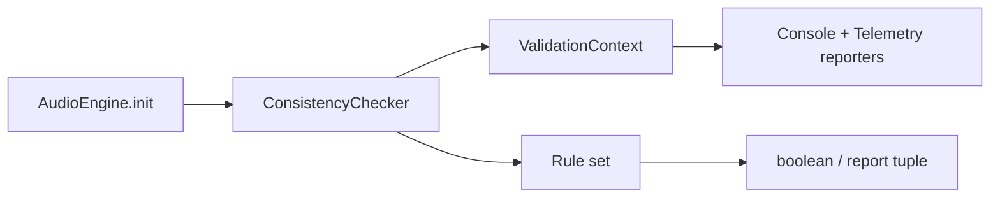

# Validation pipeline

This subsystem validates engine configuration before the runtime graph is allowed to fully initialize.

## Owned modules

- `ConsistencyChecker`
- `ValidationContext`
- reporter implementations such as `ConsoleReporter` and `TelemetryConsistencyReporter`
- validation rule families under `Rules/`

## Responsibilities

- reject missing or non-object config early;
- fan out findings to the configured reporters;
- run the full rule set over buses, snapshots, sound maps, RTPC, banks, events, music FSM, routing cycles, RAM quota, and orphan manifests;
- return a boolean or report tuple depending on caller needs;
- provide the validation gate used by `AudioEngine.init()`.

## Rule families

The rule set includes, at minimum:

- bus and routing rules;
- sound-map and snapshot rules;
- ghost ducking and multiplicative veto checks;
- RTPC manifest rules;
- bank-system and events rules;
- music-FSM rules;
- RAM quota and orphan-manifest checks.

## Initialization semantics

`AudioEngine` uses this subsystem as a startup gate. In strict mode, invalid config becomes an initialization failure; in non-strict mode, the engine can continue while warning and reporting.

## Representative tests

- `packages/engine/src/Domain/Validation/__tests__/ConsistencyChecker.test.ts`

## Scope boundary

This page is the canonical home for validation behavior. Individual rule files are best discovered here rather than split into many thin pages.
