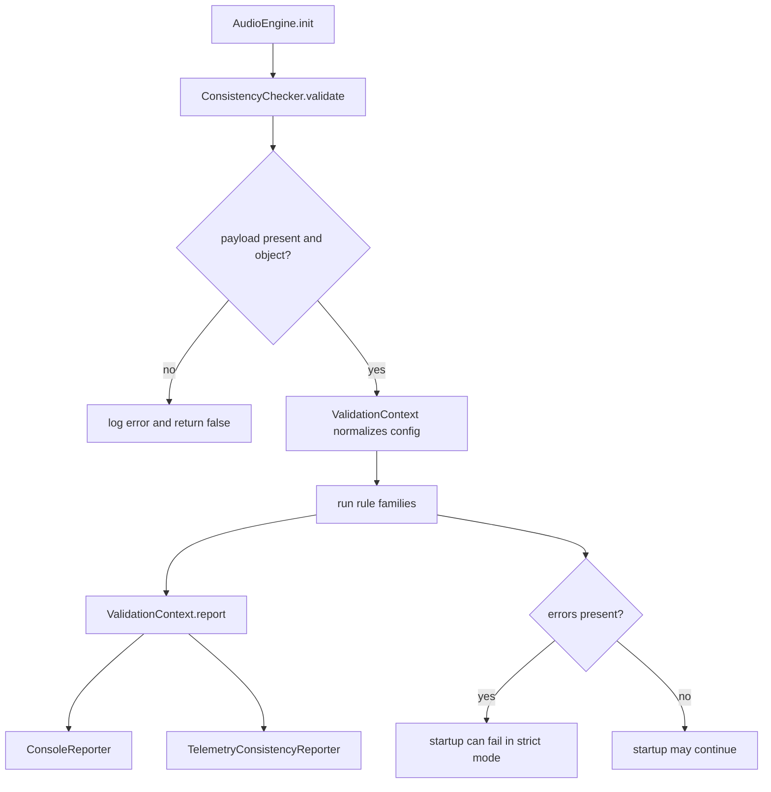

# Domain Validation and Consistency Checking

This subsystem is the engine's configuration gate. `ConsistencyChecker` runs before the runtime graph is fully activated and rejects malformed or inconsistent input early enough to stop startup when validation is strict.

## What gets checked during init

The checker is fed the aggregated engine configuration payload: manifest, buses, snapshots, sound map, RTPC manifest, events, banks, music FSM, RAM quota, and precalculated sizes. `ValidationContext` normalizes missing sections to empty objects or safe defaults so rule code can inspect the same shape consistently.

`ConsistencyChecker.validate()` also guards the most basic precondition up front: the payload must exist and must be an object. If that fails, it logs an error and returns `false` before any rule executes.

Caption: validation runs before engine initialization completes, then fans findings out to reporters.

## Validation flow

`ConsistencyChecker` builds a reporter list, creates a `ValidationContext`, runs each rule in order, and then emits the accumulated report to every reporter. The default reporter is `ConsoleReporter` unless callers provide their own reporter list.

Rule execution is fail-fast for fatal exceptions: if a rule throws, the checker logs the exception message and returns `false` without reporting a successful result. Ordinary validation findings are accumulated on the context instead of throwing.

`ValidationContext.report()` sends the final `errors`, `warnings`, and `isConsistent` flag to each reporter. That is the only fan-out point; reporters do not participate in validation logic itself.

## Rule families

The checker wires together a broad set of rule families rather than individual one-off checks. The important groups are:

- routing and bus structure, including cycle detection and send-target validity;
- sound-map consistency, including bus references and per-shape subrules;
- snapshot consistency;
- event graph and event-action validation;
- manifest cross-checks such as orphan detection and RTPC references;
- music FSM and bank-system structure;
- quota and policy checks such as RAM limits and multiplicative veto behavior.

These families are intentionally layered: `SoundMapRule` and `BusesRule` cover the high-value cross-reference checks that most directly affect startup safety, while the smaller subrules handle shape-specific constraints under those families.

## Failure semantics

Validation findings are split into errors and warnings.

- Errors mark the configuration as inconsistent. They are reported, and strict startup paths can abort initialization because the engine treats invalid config as a startup gate failure.
- Warnings are still reported, but they do not by themselves make the config inconsistent.
- A routing cycle is treated as fatal by the cycle rule and aborts validation immediately by throwing an error that `ConsistencyChecker` catches.

This means the engine can distinguish between “allowed to continue with warnings” and “must not initialize with invalid config.” The application facade documents the startup consequence: strict validation converts invalid config into initialization failure, while non-strict startup can continue after reporting.

## Reporters

`ConsoleReporter` is the default human-facing sink. It groups errors and warnings in the console and prints an OK message only when the config is consistent.

`TelemetryConsistencyReporter` wraps the same report data into a `CONSISTENCY_REPORT` packet with a `timestampMs` and dispatches it through the telemetry dispatcher. This is how validation results become observable outside the console path.

Reporters are additive: the checker can fan the same result set out to multiple sinks in one run.

## Invariants and boundary checks

The context helpers enforce a few important invariants used by the rule set:

- missing required fields become errors;
- type mismatches become errors;
- arrays are distinguished from generic objects;
- tuples must have exactly two numeric entries in increasing order when validated through the tuple helper;
- event references to missing sound targets become warnings rather than hard failures.

This boundary keeps rule code focused on domain policy instead of repeating primitive checks.

## Representative flow

1. `AudioEngine.init()` prepares telemetry reporters and invokes `ConsistencyChecker.validate()`.
2. `ConsistencyChecker` rejects null, undefined, or non-object payloads immediately.
3. `ValidationContext` fills in safe defaults and collects errors and warnings.
4. The rule set checks buses, routing cycles, sound maps, snapshots, events, manifests, banks, music FSM, and RAM quota.
5. The context reports the final result to the configured reporters.
6. Strict startup paths can abort initialization; non-strict paths can continue after reporting.

## Representative tests

`packages/engine/src/Domain/Validation/__tests__/ConsistencyChecker.test.ts` covers the behaviors that matter most here:

- valid configs pass and log an OK result;
- null, undefined, and primitive payloads are rejected before rule execution;
- empty bus sets fail;
- routing cycles are detected and stop validation;
- bus, sound-map, snapshot, event, RTPC, container, layered, smart-loop, orphan-manifest, and quota-related checks surface validation failures or warnings through the shared reporting path.

## Relationship to adjacent pages

This page documents the validation gate itself. The configuration page describes the authored input contracts, the router and managers page covers runtime behavior after validation succeeds, and the application facade page explains how startup uses this subsystem as an initialization gate.
