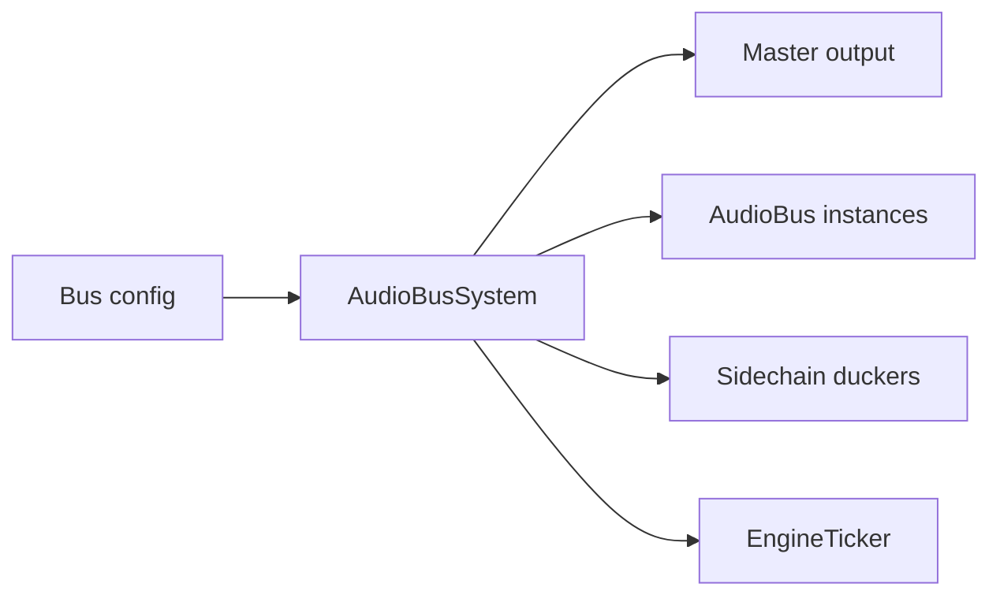

# Bus system

This subsystem owns the live audio bus graph.

## Owned modules

- `AudioBusSystem`
- `AudioBus`

## Responsibilities

- create and initialize buses from configuration;
- connect the master path and optional limiter;
- apply send routing between buses;
- maintain sidechain state and analyzer taps;
- integrate with the engine ticker for frame processing and RTPC updates;
- provide the data that the inspector analyzes.

## Failure and lifecycle behavior

The tests show several important invariants:

- custom limiter loading should fall back to the native compressor path if it fails;
- a disabled limiter path should connect master routing directly;
- sends should warn when the target bus is missing but the source exists;
- sidechain setup should be optional and isolated from non-sidechain buses;
- the system should register itself with the ticker and process all hot-path buses on tick.

## Representative tests

- `packages/engine/src/Infrastructure/busSystem/__tests__/AudioBus.test.ts`
- `packages/engine/src/Infrastructure/busSystem/__tests__/AudioBusSystem.test.ts`
- `packages/engine/src/Infrastructure/busSystem/__tests__/ColdStartAudioLeak.test.ts`

## Scope boundary

This page covers the bus graph and send application. Node construction, limiter internals, and sidechain DSP details are documented on the neighboring infrastructure pages.
