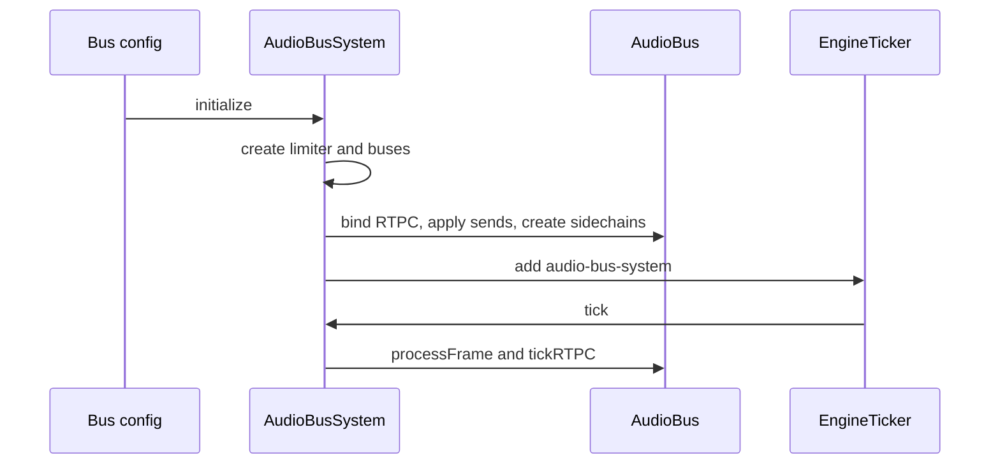

# Bus system and analyzer taps

The bus system owns the live audio-bus graph that sits between mixer state and concrete Web Audio nodes.
It creates bus objects from configuration, wires them into the master path, applies sends, and exposes the taps that other subsystems observe for ducking and analysis.

## What the bus model represents

`AudioBusSystem` is the graph owner. It keeps a map of `AudioBus` instances, one per configured bus id, and creates them from the bus configuration during initialization or hot reload.
Each `AudioBus` owns its own input gain, a pre-filter ducker tap, and a post-filter analyzer tap.

Caption: configuration becomes `AudioBus` instances, which expose internal tap points before the master output stage.

The important boundary is that `AudioBus` models routing and gain state, while Web Audio nodes are the physical implementation detail.
The bus object exposes the node handles needed for routing, but the system remains the owner of graph-wide composition.

## Routing and graph construction

`AudioBusSystem.initialize()` creates the master routing path, loads the optional limiter, initializes buses, and registers itself with the engine ticker.
When limiter usage is enabled, the system first tries the plugin limiter path; if that path fails to load, it falls back to a native `DynamicsCompressorNode` with the expected limiter settings.
If limiter use is disabled, the system connects `routerMasterGain` directly to `postLimiterGain`.

Buses are initialized from the configured `IBuses` map.
For each bus, the system:

- constructs an `AudioBus` with the shared audio context, automation engine, plugin factory, and `masterBus` routing node;
- binds RTPC configuration when present;
- applies the configured filter state through a safe replacement path;
- schedules sends to other buses;
- creates or removes sidechains according to the current bus config.

The system also registers itself as a ticker task with id `audio-bus-system` and divider `2`, then drives hot-path buses from `tick()` and `tickRTPC()`.
Those methods fan out across the cached hot-path bus array so the system can update gain/filter/send state and RTPC-driven values every frame.

## Analyzer taps and sidechain taps

`AudioBus` exposes two distinct tap points:

- `duckerTapNode` is the pre-filter tap used when the system inserts sidechain lookahead;
- `analyzerTapNode` is the post-filter tap used for observation after the bus filter stage.

The sidechain path is optional per bus.
When enabled, `AudioBusSystem` creates a sidechain ducking plugin for the bus input node, waits for it to start, and inserts lookahead at the bus's ducker tap node.
Sidechain operations are isolated to buses that have an active sidechain entry; attempts to trigger a missing sidechain are ignored rather than crashing.

## Send application semantics

Sends are owned as per-bus state inside `AudioBus`, but applied at system level.
`AudioBusSystem.applySend()` looks up both buses, warns when the source exists but the target bus is missing, and forwards the update to the source bus.
A send can also be cleared by passing `null` as the target gain; in that case the source bus is updated with a null target node and the send fades out before being removed.

`AudioBus` keeps send state by target bus id and processes it during `processFrame()`.
That processing path is where logical gain, RTPC gain, filter frequency, pan, and send gain updates are actually ramped into the underlying Web Audio parameters.

## Lifecycle and cold-start behavior

Every `AudioBus` performs a cold-start initialization on construction.
The cold-start tests verify that the system does not leak audible audio when a mixer transition changes state and playback begins immediately afterward.
That invariant matters because bus creation and initial gain staging are part of the observable audio boundary, not just internal bookkeeping.

Caption: startup wires the graph once, then the ticker keeps the hot-path buses current.

## Invariants supported by tests

The focused tests establish the following behavioral constraints:

- custom limiter loading can fail and should fall back to the native compressor path;
- disabling limiter use should connect the master routing path directly;
- bus initialization should create the configured buses and register the system with the ticker;
- `tick()` should process each hot-path bus, and `tickRTPC()` should fan out RTPC updates to those same buses;
- sends warn when the source exists but the target bus does not, while clearing a send with `null` is allowed;
- sidechain setup is optional, isolated per bus, and safe to call only when the sidechain exists;
- the cold-start path should not leak audio when state changes and playback begins immediately afterward.

## Extension points and operations

The main extension surface is configuration.
Adding a new bus to the config causes the system to create a matching `AudioBus` during initialization or config reload.
Enabling sidechain on a bus causes the system to create a corresponding ducking plugin and tap the bus's pre-filter node.
Changing send mappings in the config updates routing without requiring a separate graph manager.

The page boundary is intentional:

- bus-system documents routing, ownership, and tap placement;
- `nodes.md` documents concrete node-chain composition and the final master-output boundary;
- `telemetry.md` and inspector pages document how the resulting state is observed.

## Representative tests

- `packages/engine/src/Infrastructure/busSystem/__tests__/AudioBus.test.ts`
- `packages/engine/src/Infrastructure/busSystem/__tests__/AudioBusSystem.test.ts`
- `packages/engine/src/Infrastructure/busSystem/__tests__/ColdStartAudioLeak.test.ts`
