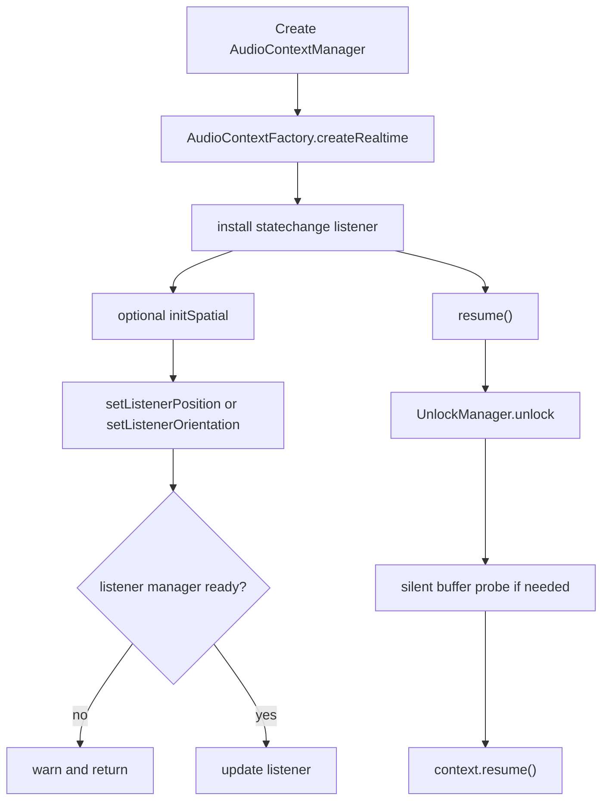

# Audio Context and Unlock Lifecycle

This subsystem owns the browser audio-context boundary for the engine runtime. It is the first place the engine touches browser audio APIs directly, so it has to respect user-gesture gating, browser feature differences, and the lifecycle of the underlying `AudioContext`.

## Owned modules

- `AudioContextFactory` creates realtime and offline browser audio contexts.
- `AudioContextManager` owns the realtime context, state observation, and high-level context operations.
- `ListenerManager` updates listener position and orientation.
- `UnlockManager` handles browser gesture-gated unlock behavior.
- `WorkletLoader` loads audio worklet modules into a context.

## Lifecycle and responsibilities

`AudioContextFactory` is the creation boundary. It builds a realtime `AudioContext` with `latencyHint: 'interactive'` and passes through an optional sample rate. It also exposes an offline-context constructor for non-realtime use.

`AudioContextManager` is the operational owner of the realtime context. It exposes the native context, current state, sample rate, and current time, and it forwards `statechange` events through `onStateChange` when a caller registers one. It also mediates context lifecycle calls:

- `resume()` delegates to the unlock flow rather than calling the native context directly;
- `suspend()` only suspends when the context is currently `running`;
- `close()` only closes when the context is not already `closed`.

The manager also gates spatial control behind explicit initialization. Call `initSpatial(automation)` before setting listener position or orientation; otherwise it warns and does nothing.

The diagram shows the normal initialization and unlock path. The same manager also handles suspend and close as guarded terminal operations.

## Listener responsibilities

`ListenerManager` is responsible for translating spatial updates into the browser listener API. It uses `AutomationEngine.ramp()` with 50 ms smoothing when the browser exposes param-based listener fields such as `positionX` and `forwardX`.

When param-based fields are not available, it falls back to the legacy synchronous methods `setPosition()` and `setOrientation()` if the listener exposes them. That makes spatial updates work across modern and older browser implementations without leaking compatibility logic into the rest of the engine.

## Unlock behavior

`UnlockManager` exists because browser audio often stays suspended until a user gesture allows audio playback. Its job is to make a best-effort unlock attempt and remember whether the context has already been unlocked.

Operationally, it follows this sequence:

1. If the context is already `running`, mark it unlocked and return.
2. If this is the first unlock attempt, try to create and start a one-sample silent buffer source.
3. Ignore errors from the silent-buffer probe.
4. Call `context.resume()`.
5. Mark the context unlocked.

That means unlock attempts are intentionally idempotent from the caller’s point of view: repeated `resume()` calls do not recreate the silent probe once the manager has already succeeded, and the code tolerates probe failures without aborting the resume attempt.

## Worklet loading

`WorkletLoader.loadModule(context, rawCode)` loads a transpiled `AudioWorkletProcessor` body into the target context. It first requires `context.audioWorklet` to exist, then tries a `blob:` URL created from the raw code. If that module load is rejected, it falls back to a base64 `data:` URI. If both fail, it throws a detailed error that includes both failure causes.

The blob URL is always revoked in a `finally` block, so temporary object URLs do not leak even when module loading fails.

## Failure and operational boundaries

This subsystem is deliberately conservative:

- it never assumes the browser can create or run audio without a real `AudioContext` implementation;
- it separates spatial updates from context creation so callers must opt in to listener control;
- it handles user-gesture unlock constraints without corrupting state on repeated attempts;
- it treats worklet loading as a browser capability that can fail because of missing support or content-security-policy restrictions.

## Representative tests

- `packages/engine/src/Infrastructure/context/__tests__/AudioContextFactory.test.ts`
- `packages/engine/src/Infrastructure/context/__tests__/AudioContextManager.test.ts`
- `packages/engine/src/Infrastructure/context/__tests__/ListenerManager.test.ts`
- `packages/engine/src/Infrastructure/context/__tests__/UnlockManager.test.ts`
- `packages/engine/src/Infrastructure/context/__tests__/WorkletLoader.test.ts`

## Scope boundary

This page only covers the browser audio-context boundary. Bus routing, limiter setup, mixer transitions, and worklet processor internals belong on their own pages.
