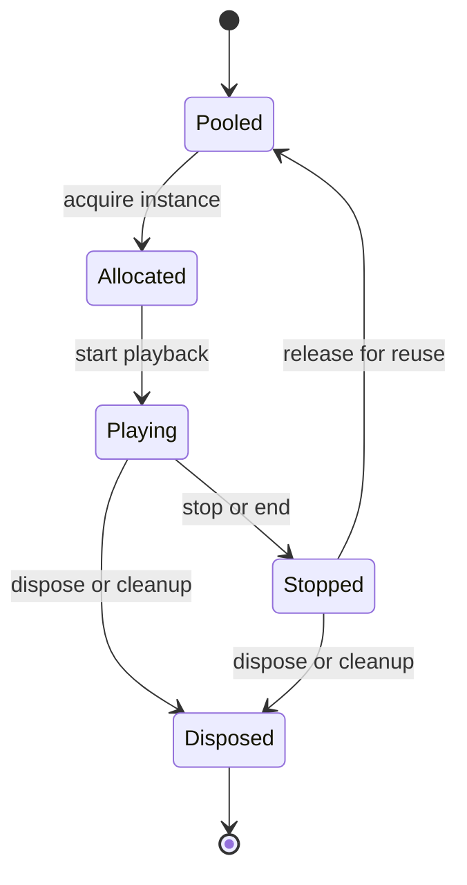

# Sound Instances and Voice Pooling

This subsystem owns the runtime object model for individual sound playbacks. It sits at the boundary where a logical sound request becomes a concrete voice that can be started, reused, and eventually cleaned up.

## Owned modules

- `SoundInstance` represents a live playback instance.
- `SoundPoolManager` manages reuse and lifecycle of instances.

## Runtime role

`SoundInstance` is the per-voice state holder. Tests show it tracks the active source, knows whether the instance is playing, can be reused after a stop, and is responsible for releasing internal references when it is disposed.

`SoundPoolManager` owns the pool of reusable voices. It hands out instances for playback, takes them back when they are no longer active, and keeps the pool from growing without bound by recycling or dropping instances according to capacity and lifecycle state.

Caption: a voice moves from pooled allocation to active playback and back, with disposal as the terminal cleanup boundary.

## Responsibilities

- create reusable playback instances;
- connect and disconnect sound graphs safely;
- avoid allocation churn during heavy gameplay;
- keep per-instance state isolated enough for testing and reuse;
- return finished voices to the pool so later playback can reuse the same allocation instead of creating a fresh one;
- clear instance-owned references on stop or dispose so stale playback state does not leak into the next voice.

## Ownership and lifecycle invariants

The key invariant is that a voice is owned by exactly one active lifecycle stage at a time. Once `SoundPoolManager` lends an instance to a caller, that caller owns the live playback until the instance is stopped or returned. After cleanup, the manager may recycle the instance, but it must not allow the same live voice to be shared concurrently across multiple playbacks.

Cleanup is the guardrail that protects GC stability. The pool manager only remains healthy if stopped or disposed instances release their graph links and internal references before reuse, because otherwise stale connections would keep old voices reachable and make later reuse unsafe.

## Lifecycle boundaries

- Acquisition is the only place where a new active playback instance should appear.
- Active use is limited to the voice currently attached to playback.
- Release happens when playback ends or a caller explicitly stops the instance.
- Disposal is terminal for a voice that should no longer be reused.

The page intentionally stays at the instance/pool layer. Higher-level routing policy belongs to the domain router pages, while scheduling and pressure handling live on the scheduling page.

## Representative tests

- `packages/engine/src/Infrastructure/instance/__tests__/SoundInstance.test.ts`
- `packages/engine/src/Infrastructure/instance/__tests__/SoundPoolManager.test.ts`

The focused tests matter because they cover the behaviors that keep pooling safe: reuse after cleanup, state reset between playbacks, and lifecycle handling for returned or disposed voices.
