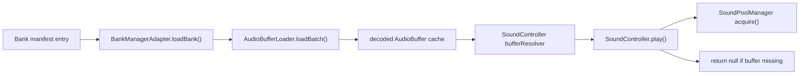

# Loaders and Sound Control

This subsystem owns the runtime path from manifest entries to decoded audio buffers and then into the sound controller that higher-level runtime code uses for playback.
It is concerned with asset availability, bank lifecycle, and the bridge between loaded data and voice control, not with file-system concerns.

## Owned modules

- `AudioBufferLoader` fetches, decodes, caches, and evicts audio buffers.
- `BankManagerAdapter` coordinates bank loading, unloading, and load-state tracking.
- `SoundController` resolves loaded buffers at play time and exposes the playback control surface used by orchestration code.

## Runtime asset flow

The loader path is pull-based at the point of playback: the sound controller asks a resolver for the current buffer for a sound URL, and playback fails closed if no buffer is available.
That makes loaded assets a runtime dependency rather than a static reference; a sound can be registered while its bank is unloaded, but `SoundController.play()` returns `null` until the buffer resolver can supply a decoded buffer.

Caption: bank loading populates the buffer cache, and playback consumes that cache through a resolver instead of holding a permanent asset handle.

## `AudioBufferLoader`

`AudioBufferLoader` is the asset-backed cache and decoding boundary.
It resolves the first supported URL from a list of candidates, deduplicates concurrent loads for the same URL, and uses a `ConcurrencyThrottler` to limit simultaneous decode work.
When a buffer is already cached, `load()` returns the cached `AudioBuffer` and refreshes its MRU position instead of decoding again.

The loader also tracks a RAM quota and evicts lower-priority entries first when it needs room for a new buffer.
If low-priority entries are exhausted, it can emergency-evict high-priority entries and report the eviction through the optional `onEmergencyEviction` callback.
This is the main operational safeguard for keeping the buffer cache inside its configured budget.

Batch loading is explicit and observable:

- `loadBatch()` accepts a keyed request map and returns the successfully loaded buffers as a keyed result map;
- it returns immediately for an empty batch;
- per-item progress and per-item errors are surfaced through callbacks;
- failures do not abort the rest of the batch, because the method waits for all loads to settle and then returns the successful subset.

The loader also exposes cache-management entrypoints for runtime cleanup:

- `clearCache()` with no URL resets the entire cache and internal free-list state;
- `clearCache(url)` removes one cached entry;
- `getBuffer()` performs lookup by URL or by supported URL candidate list;
- `purgeUrls()` removes a set of URLs, which is the unload path used by bank management.

## `BankManagerAdapter`

`BankManagerAdapter` is the bank-lifecycle coordinator.
It keeps an internal `BankState` map and reports `UNLOADED` for unknown or not-yet-loaded banks.
`loadBank()` is idempotent for the `LOADED` and `LOADING` states, so concurrent or repeated load requests do not re-enter the batch load path.

For a known bank, the adapter builds a request list from the bank manifest and the sound manifest, filling in per-sound priority and using a precomputed size when available, or `5.0` MB as the default size estimate.
It then drives `AudioBufferLoader.loadBatch()` and translates the loader callbacks into bank-level events:

- `onStart(totalItems)` when a non-empty bank load begins;
- `onProgress(loadedItems, totalItems, progress, lastKey)` as each item settles;
- `onError(key, error)` for individual failures;
- `onComplete(failedItems, durationMs)` after the batch finishes.

If a bank has no loadable sounds, the adapter marks it `LOADED` and completes immediately.
If `loadBatch()` throws, the adapter marks the bank `ERROR` and rethrows, so callers can observe the failure while the bank state also records it.

Unload is the inverse path.
`unloadBank()` stops each sound through the router with `allowTail: false`, purges the corresponding sounds from the pool, removes their URLs from the buffer cache, flips the bank state back to `UNLOADED`, and emits `onUnload(bankId)` when events are configured.
That sequencing matters because it prevents stale voices from surviving the bank unload and keeps playback, pooling, and cache state aligned.

## `SoundController`

`SoundController` is the runtime controller used by routing and orchestration code once a decoded buffer is available.
It stores sound registrations, asks the injected buffer resolver for the current `AudioBuffer` at play time, and refuses to start playback if the sound is unregistered, the buffer is missing, or the sound is still inside its cooldown window.
On successful play it acquires a pooled instance, builds the logical voice record, applies loop and rate settings, schedules playback, and emits lifecycle telemetry for the start action.

The controller also owns the control surface used by higher-level runtime code:

- `register()` and `unregister()` manage sound definitions and pool cleanup;
- `play()` creates playback instances on demand;
- `setPosition()`, `getPosition()`, `routeToBus()`, `addSidechainTrigger()`, and `removeSidechainTrigger()` drive spatial and routing effects;
- `stopById()`, `stopAll()`, `pauseById()`, `pauseAll()`, `resumeById()`, and `resumeAll()` manage voice lifecycle;
- `tick()` handles virtual-voice timers and can force natural ends when timers expire.

That interface is what the router and application façade delegate to when they need to manipulate an already-created voice.
The controller is also explicit about missing resources: the tests show that unloaded banks produce a missing-buffer result, which causes play to return `null` instead of constructing a half-initialized voice.

## Error handling and telemetry

The most visible error paths are operational rather than exceptional:

- `BankManagerAdapter` warns and aborts when a bank id is absent from the manifest;
- `AudioBufferLoader.loadBatch()` reports item-level errors through the supplied callback instead of failing the whole batch;
- `SoundController.play()` emits a `CAUSE_CHAIN` telemetry event with a `BLOCKED` result when the pool rejects playback.

Those behaviors keep load, decode, and playback failures observable without forcing the rest of the runtime to guess at partial state.

## Extension points and operations

- Add new asset resolution behavior in `AudioBufferLoader.resolveFirstSupportedUrl()`-style lookup paths without changing the controller API.
- Add new bank-level reporting by extending `IBankLoadEvents` and translating loader events in `BankManagerAdapter`.
- Add new runtime playback behaviors by extending `SoundController` while keeping unresolved buffers a fail-closed condition.
- Tune buffer memory pressure by adjusting loader capacity, RAM quota, or emergency-eviction hooks.

## Representative tests

- `packages/engine/src/Infrastructure/loader/__tests__/AudioBufferLoader.test.ts`
- `packages/engine/src/Infrastructure/loader/__tests__/BankManagerAdapter.test.ts`
- `packages/engine/src/Infrastructure/loader/__tests__/SoundController.test.ts`

The focused tests cover batch progress and error reporting, cache reset and purge behavior, bank-state transitions, unload cleanup, dynamic buffer resolution, cooldown gating, and telemetry emitted for blocked playback.
