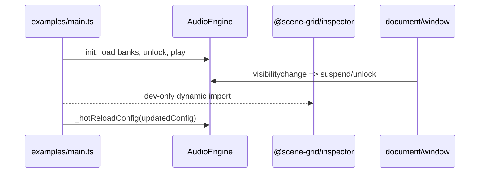

# Example app runtime

This page is the canonical home for the repository’s demo and runtime consumption workflow.

## Entrypoints

- `examples/main.ts`
- `examples/inspector.tsx`

## Runtime sequence

1. Build `AudioEngine` from the example audio config.
2. Subscribe to load and error events for user feedback.
3. Call `audio.init({ isStrictValidation: false })`.
4. Load the demo banks.
5. Wait for a user gesture and unlock the audio context.
6. Start playback and, in development, attach the inspector overlay.
7. Pause and resume with `visibilitychange`.
8. Apply hot-module config updates through `audio._hotReloadConfig`.

## Important behaviors

- bootstrap should fail softly and log if init throws;
- the demo keeps the inspector out of production builds;
- visibility changes map to engine suspend/unlock behavior;
- HMR updates only replace the config slices that are expected to change live.

## Representative source evidence

- `examples/main.ts` for the full runtime lifecycle
- `examples/inspector.tsx` for the inspector mount hook

## Scope boundary

This page documents the example workspace only. Package internals live on the engine, inspector, and shared pages.
