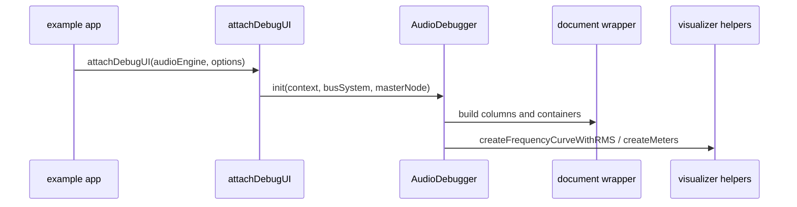

# Inspector debugger runtime

This page documents the runtime entry that turns engine debug state into a visible panel.

## Entrypoints

- `AudioDebugger` in `packages/inspector/src/AudioDebugger.ts`
- `attachDebugUI` in `packages/inspector/src/index.ts`
- `initAudioDebugPanel` in `packages/inspector/src/AudioDebugPanel.ts`

## Responsibilities

- validate that the engine exposes the expected debug surface;
- attach live bus, master, and visualizer columns to the DOM;
- delegate deeper control-surface construction to the debug panel;
- keep failure behavior soft when the wrapper element or engine debug object is missing.

## Important invariants

- a missing wrapper element should warn and return instead of throwing;
- the master bus is always included first in the analysis view;
- each active bus with an analyzer tap gets its own column and meter/curve widgets;
- the runtime should stay mockable in tests by accepting a worklet-loader contract.

## Representative tests

- `packages/inspector/src/__tests__/AudioDebugger.test.ts`

## Scope boundary

The control panel, profiler, and meter/graph helpers are documented on the UI-and-hooks page.
